# Utilizando o RMA

## Introdução: 

Interface inicial: 

- Funções importantes que iremos utilizar:

	-------------------------
	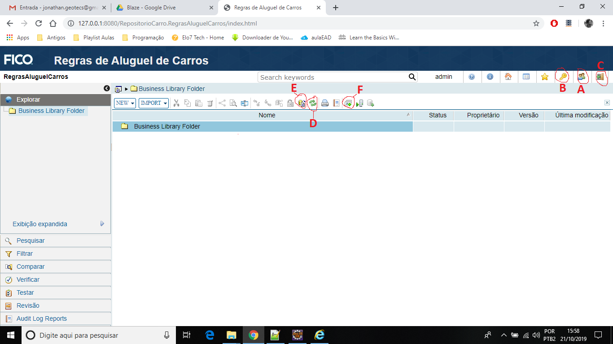

	------------------------

	- No ícone adminitrador [A], você pode gerenciar os usuários que estão trabalhando neste projeto.
	- Também há os ícones senha [B] e log off [C] que, de certa forma, fazem parte do gerenciamento de usuários. 
	- Outros ícones importantes são: Atualizar[D], Atualizar/Update[E] e Compilar[F]. 
		

					
Funcionalidade/Nomenclaturas:

- Decision flow = Fluxo de decisões
- Decision table = Tabela de decisão
- Decision tree = Árvore de decisão
- Function = Função 
- ScoreCard = Sistem de scoragem 
- Business Term Set = Variáveis que os usuários podem criar
- Ruleset (Rulebuilder) = Regras "simples" de negócios

Saindo e entrando no projeto RMA

- Ao ligar o PC, como nosso RMA está embarcado no eclipse, devemos abrir o eclipse e startar o projeto: 
	- Clicar no projeto - Ir na aba Project - Rule Maintenance Application - Start [Iniciar] - Finish. 
- Após startar o projeto devemos abrir o RMA:
	- Clicar no projeto - Ir na aba Project - Rule Maintenance Application - Open [Abrir].

## Decision Flow

Criando um fluxo principal 

- Com o projeto rodando no local host (RMA), clicar com o botão direito sobre a pasta **Business Library Folder** 
- Ir em New - Decision Flow - dar o nome de Fluxo_Principal. Lembre-se que o nome deve ser o mesmo que você atribuiu no tutorial anterior.

	-------------------------
	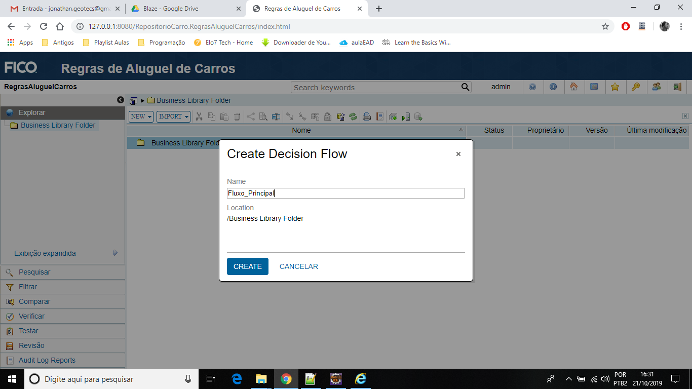

	------------------------

	-------------------------
	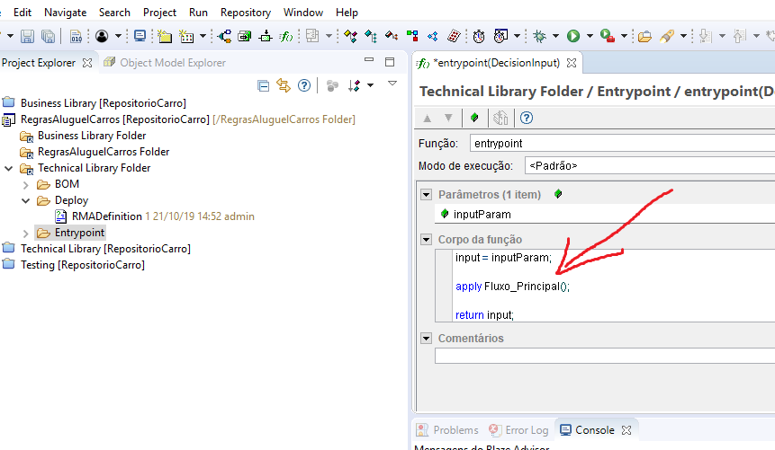

	------------------------

	-------------------------
	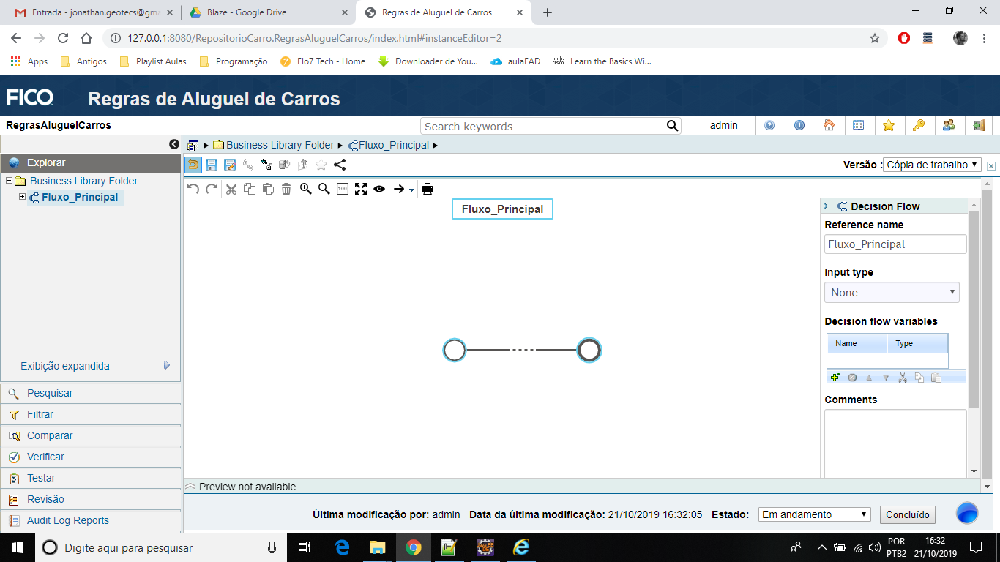

	------------------------

## Organizando o projeto em pastas

Para ter um bom projeto é necessário estar bem organizado. Iremos, neste tópico, organizar o nosso projeto em pastas que serão utilizadas conforme o projeto ganhe maiores proporções. 
	
- Clicar na pasta principal **Business Library Folder** e ir na aba NEW - FOLDER
	- Nome: Ruleset
-----------
- Clicar na pasta principal **Business Library Folder** e ir na aba NEW - FOLDER
	- Nome: BusinessTerm
-----------	
- Clicar na pasta principal **Business Library Folder** e ir na aba NEW - FOLDER
	- Nome: DecisionTable
-----------
- Clicar na pasta principal **Business Library Folder** e ir na aba NEW - FOLDER
	- Nome: DecisionTree
-----------
- Clicar na pasta principal **Business Library Folder** e ir na aba NEW - FOLDER
	- Nome: Function
-----------
- Clicar na pasta principal **Business Library Folder** e ir na aba NEW - FOLDER
	- Nome: Scorecard
-----------

OBS: Não é necessário criar todas as pastas agora. Você pode ir criando conforme necessidade. Estou criando todas agora para fins didáticos. 
						
-------------------------
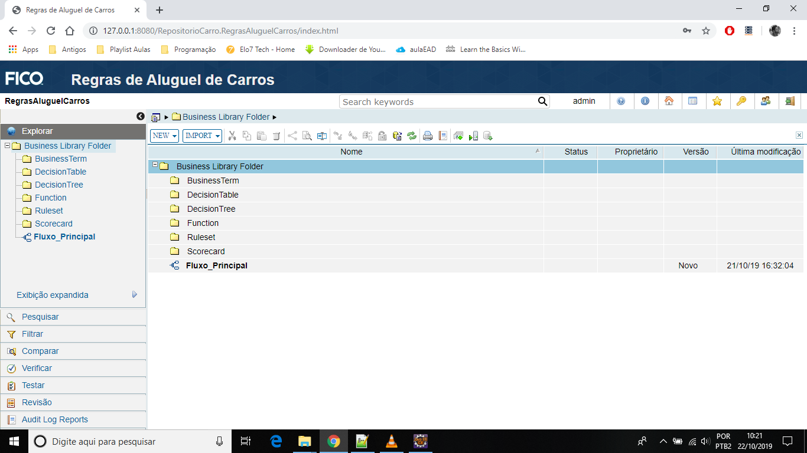

------------------------						

## Decision Tree

Iremos criar nossa primeira Task de decisão do Fluxo_Principal. Será uma Decision Tree que utilizará os dados de idade e renda para dividir grupos de clientes em aprovados ou reprovados. 

1. Criando um modelo de Variável de Negócio [BusinessTerm]
	- Clicar na pasta BusinessTerm - New - Business Term Set
	- Dar o nome de **VariaveisNegocio**

	-------------------------
	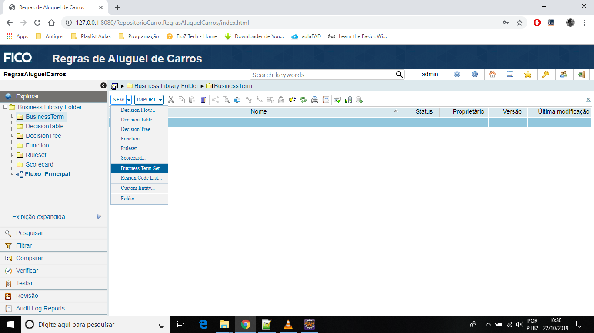

	------------------------

2. Criando um Value List
	- Clicar no segundo sinal de + e depois clicar no **Value List 1** que irá aparecer.

	-------------------------
	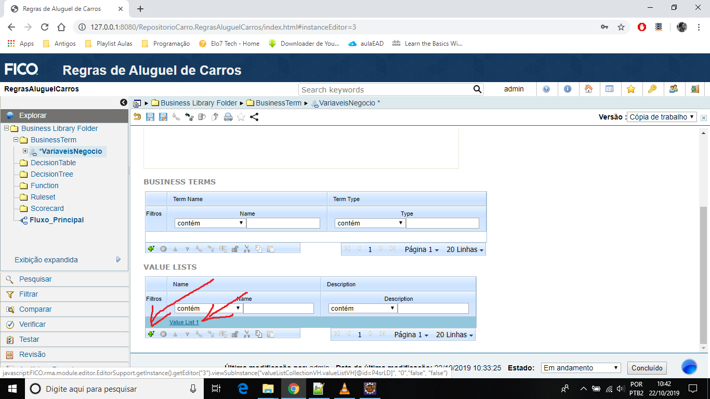

	------------------------

	- Na nova tela, você deverá dar o nome de **NegadoAprovado** e atribuir os valores de negado e aprovado, conforme a imagem abaixo. 
	- Por fim, clicar em check-in para que as alterações tenham efeito.

	-------------------------
	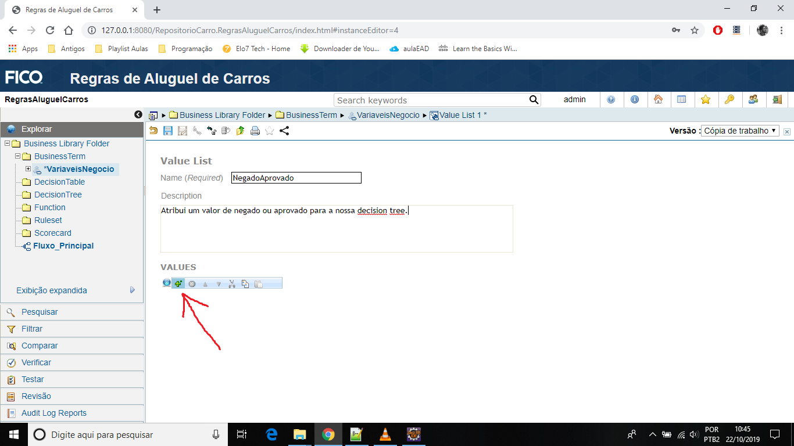

	------------------------

	-------------------------
	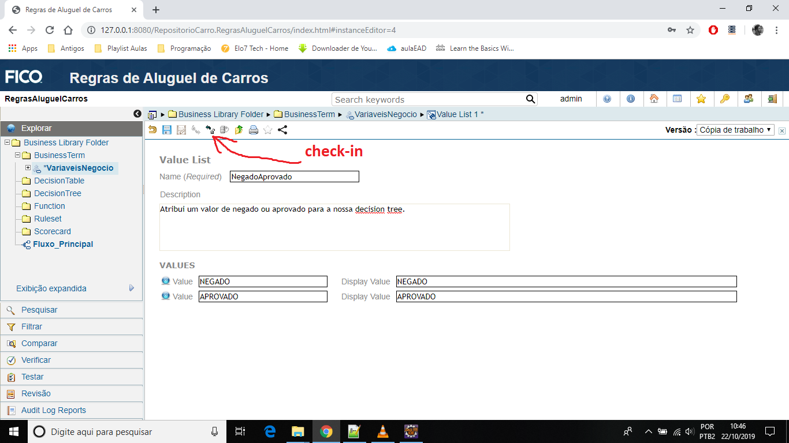

	------------------------

	- Após o check-in, voltar na tela anterior. 

	-------------------------
	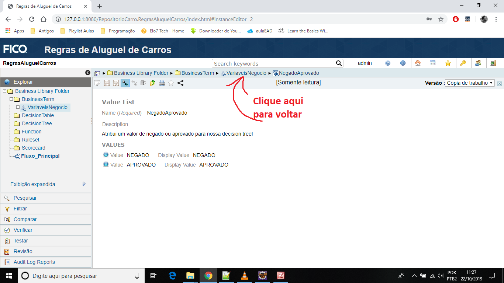

	------------------------

3. Criando um Business Term
	- Ao acessar novamente a aba **VariaveisNegocio** você deverá clicar na opção check-in. 
	- Clicar no primeiro sinal de + e depois clicar no **term1** que irá aparecer. Observe a imagem.

	-------------------------
	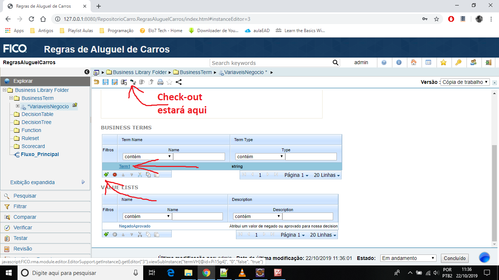

	------------------------

	- Dar o nome de: NegadoAprovadoAtributo, deixar o tipo como String e atribuir o Value List como NegadoAprovado.
	- Fazer o check-in.
	
	------------------------	
	
4. Criando de fato a Decision Tree
	- Clicar na pasta DecisionTree - ir na aba New - opção Decision Tree.
	- Colocar o nome de: TreeNegadosAprovados, adicionar uma descrição, deixar o tipo como Void e clicar em Next.  
	- Nesta janela você deve selecionar as variáveis (Idade e Renda) que vai usar e clicar em Next. Observe a imagem. (Lembre-se, estas variáveis são definidas no arquivo.jar que está no drive e você já deve ter importado no tutorial anterior).
	- O mesmo se repete na proóxima janela (Action). (Na ação iremos usar a variável que acabamos de criar).

	-------------------------
	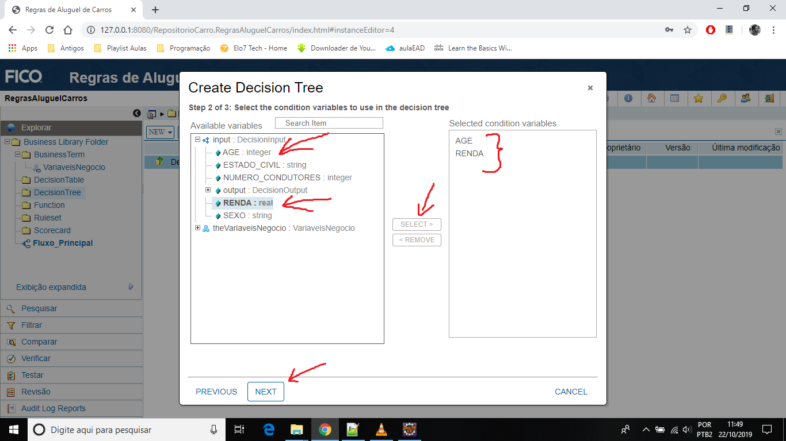

	------------------------

	-------------------------
	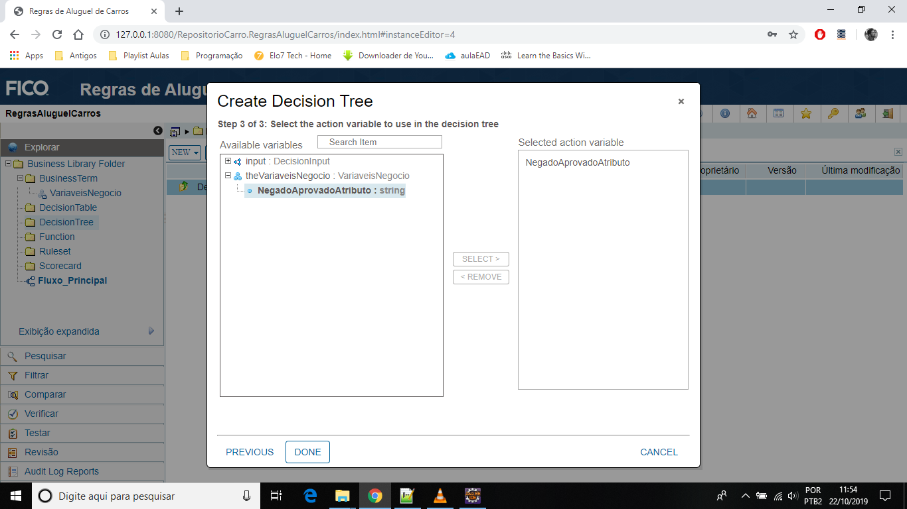

	------------------------

						
	- Após configurar as variáveis, a janela de criação de árvores de decisão irá aparecer. 
	- Basta clicar com o botão direito do mouse sobre o ícone do Start para iniciar a construção da Decision Tree.

	-------------------------
	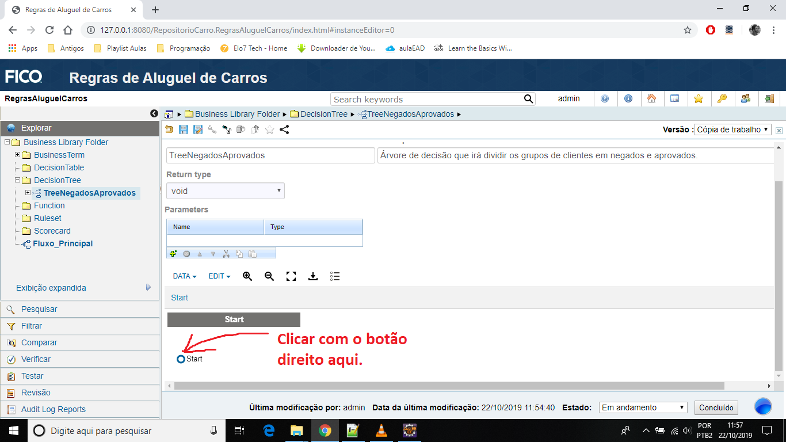

	------------------------

						
	- Após clicar com o botão direito do mouse sobre o ícone Start, ir na opção **Insert Split**
	- Selecionar a primeira variável que irá segmentar nossos clientes: Idade (AGE). 
	- Neste momento, iremos segmentar da seguinte forma: Clientes menores de 18 (Negado) e clientes maiores que 18 (Aprovado).
		- Basta digitar 18 e clicar em Add. Depois clicar em Apply. 

	-------------------------
	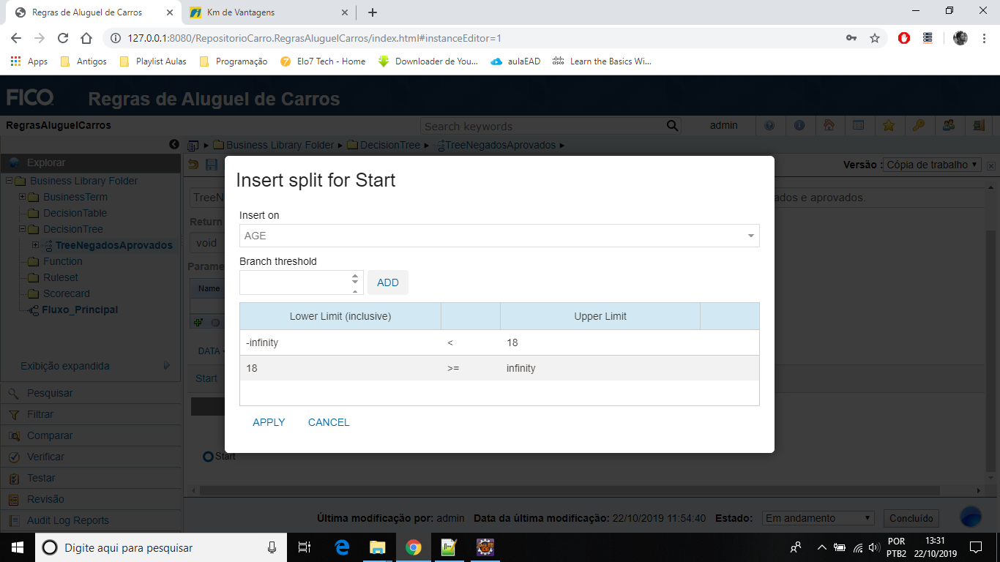

	------------------------

						
	- Iremos criar nossa segunda segmentação: clientes com renda inferior a R$ 1000 serão considerados Negado. 
		- Basta clicar com o botão direito do mouse sobre a próxima área que queremos segmentar e ir na opção **Insert Split** 
		- Neste caso, queremos segmentar os clientes que têm 18 anos ou mais, pois os menores de idade já foram classificados como Negado. 
		- Observe a imagem a seguir:

	-------------------------
	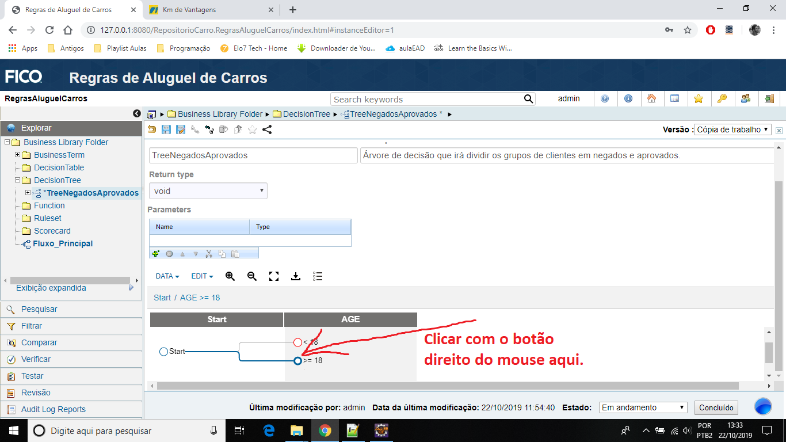

	------------------------

	
	- Na tela de Insert Split, selecione a variável renda.
	- Coloque o valor de 1000 e clique em ADD. Depois clique em Apply.

	-------------------------
	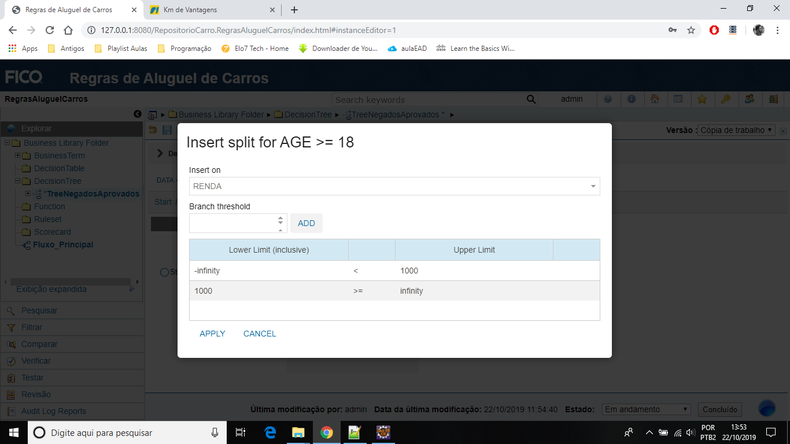

	------------------------

	-------------------------
	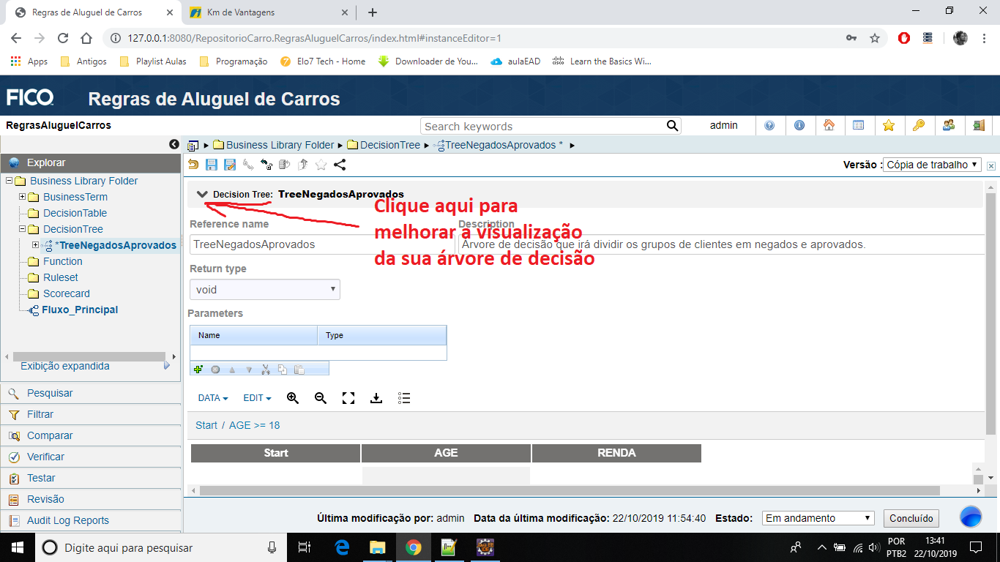

	------------------------
						
	
	- Por fim, iremos atribuir os valores de Negado e Aprovado à nossa árvore de decisão. 
		- Clicar com o botão direito do mouse sobre o primeiro valor a ser acionado. 
		- Selecionar a opção Assign Value e ecolher a ação Negado. 
		- Repetir o processo para os outros três pontos. 

	-------------------------
	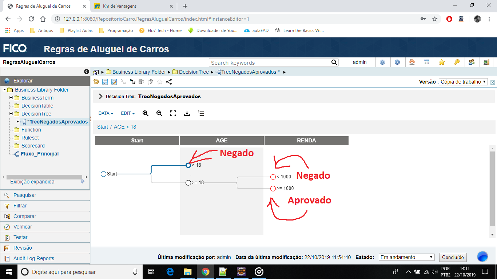

	------------------------

	- Sua Decision Tree deverá ficar como na imagem abaixo. Agora basta fazer o **check-in** para salvar as alterações.
	- Clicar em Fluxo_Principal para acrescentar nossa árvore de decisão.

	-------------------------
	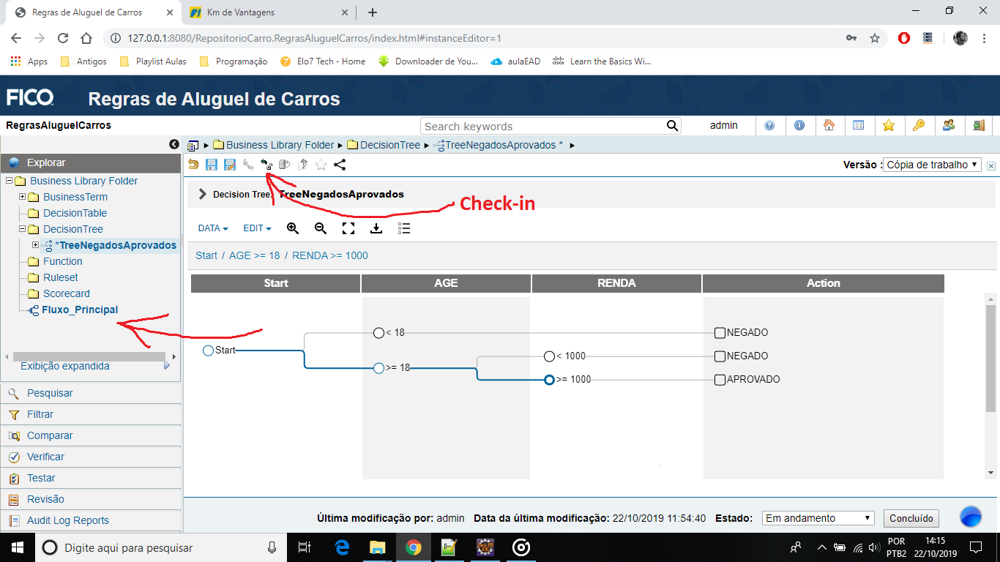

	------------------------
						
	
5. 	Adicionando a Decision Tree no Fluxo.
	- Após clicar no Fluxo_Principal, você deve clicar em check-out e adicionar um Task, como ilustrado na imagem abaixo.

	-------------------------
	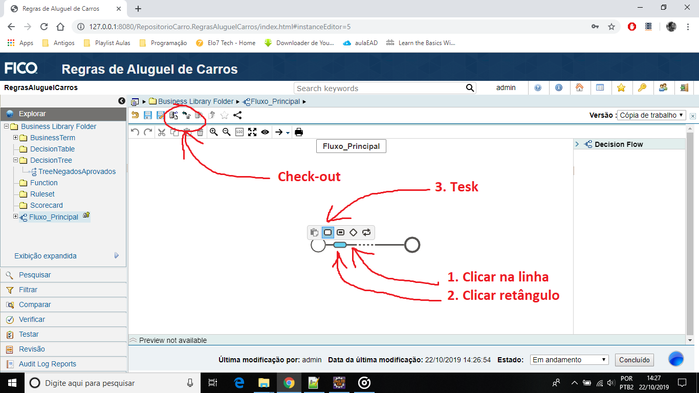

	------------------------	

	- Após adicionar a Task, você deve escolher um nome, chamar a Decision Tree que acabamos de criar e clicar em Apply. (Fazer o **check-in**)

	-------------------------
	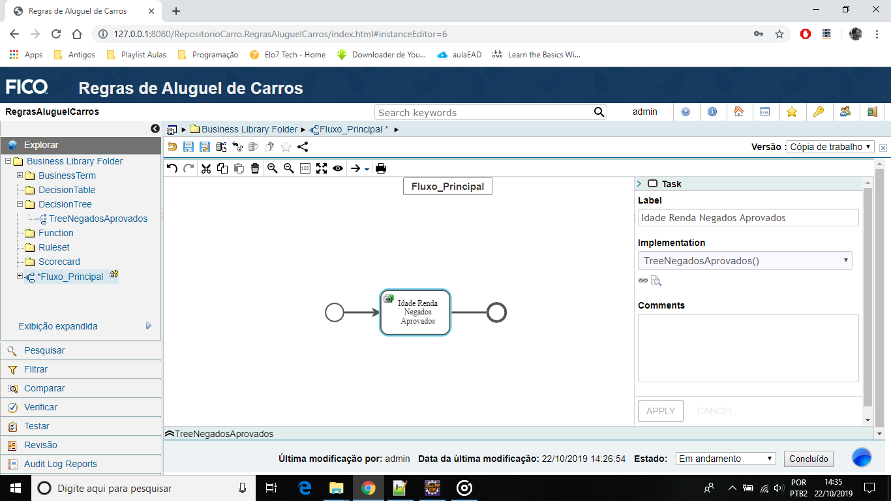

	------------------------
						

## Function

Neste tópico, iremos criar uma função para que de fato nossa Decision Tree criada no tópico anterior tenha um efeito de output. 

Até o momento, nossa Decision Tree divide o grupo de clientes em Aprovados e Negados, conforme sua Idade e Renda.

Agora iremos criar uma função que recebe estes valores (Aprovado ou Reprovado) e armazena na variável DECISION. Lembrando que esta variável foi criada no arquivo.jar. (Em breve farei mais tutoriais sobre este arquivo).

1. Criando a função.
	- Clicar na pasta Function que criamos e em seguida ir em NEW - Function.
	- Colocar o nome de FunctionNegadosAprovados.
	- Nota-se que o nome da função é semelhante ao da árvore de decisão (TreeNegadosAprovados). Isso facilita a compreensão das partes. 
	- Clique na opção [Switch to Rule Builder] para acionar o modo de edição simples de código. Depois clique no editor de código. 

	-------------------------
	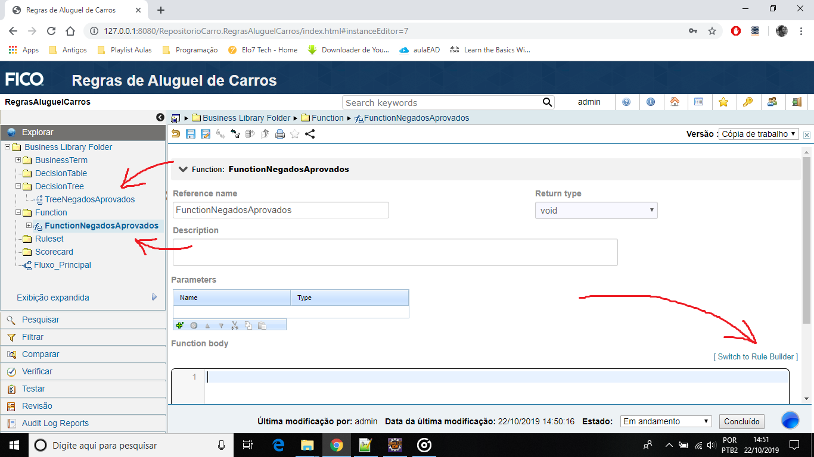

	------------------------

	-------------------------
	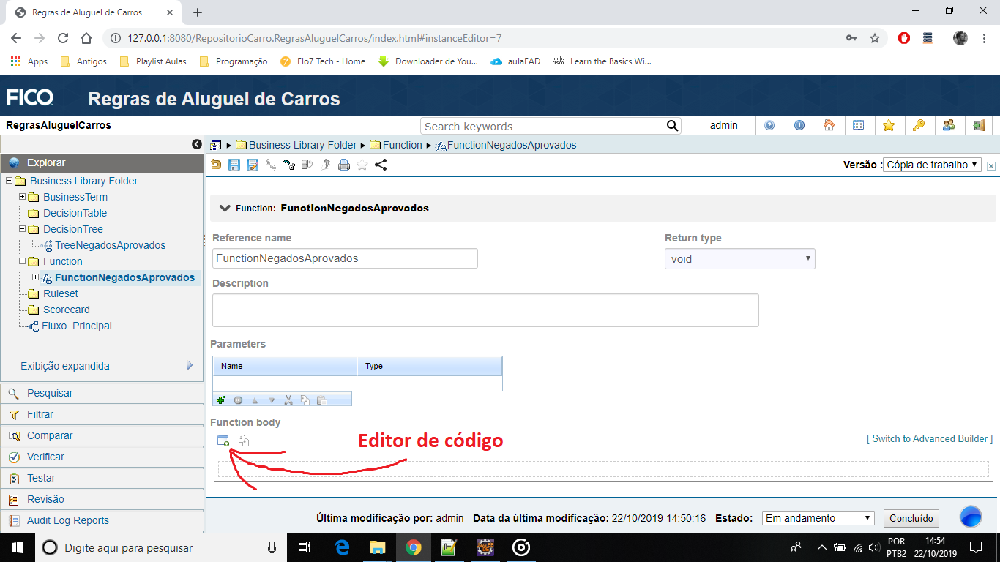

	------------------------
	

	- No editor de código, escolha a variável que deseja armazenar os outputs da árvore de decisão. 
	- Para este tutorial, utilizaremos a variável Decision. 
	- Escolher a variável que vai armazenar no nosso output.
	- O editor funciona no modo de arrasta e solta. Você clica na variável, arrasta até o lugar e solta. 
	- Clique em Done para finalizar. 
	- Faça o **check-in**
	- Observe as imagens abaixo como exemplo:

	-------------------------
	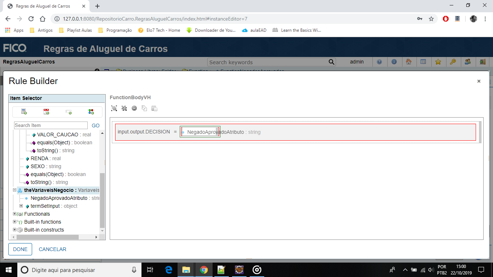

	------------------------

	-------------------------
	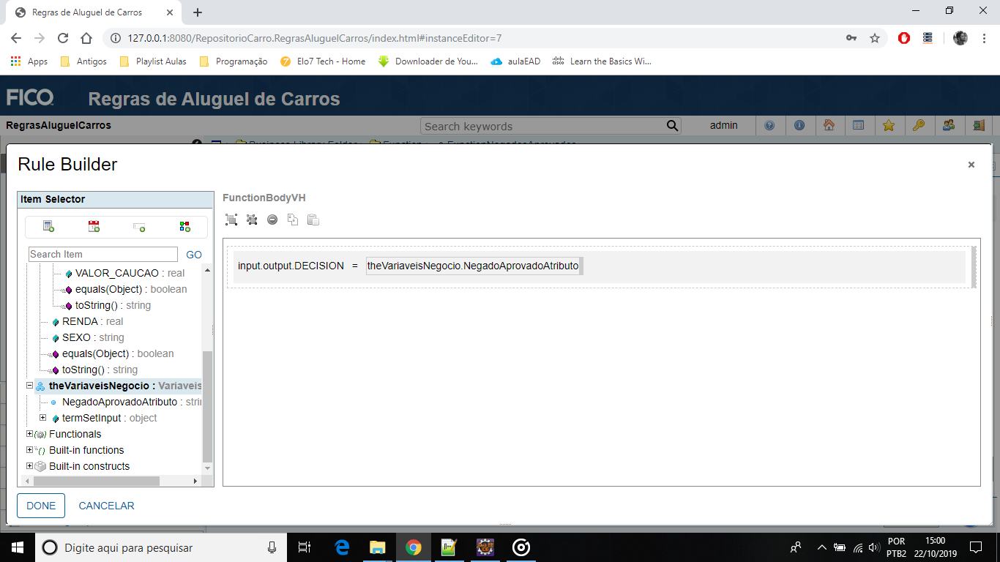

	------------------------

2. Adicionando a função ao Fluxo_Principal:
	- O processo é semelhante ao adicionar a árvore de decisão no fluxo. 
	- Após clicar no Fluxo_Principal, você deve clicar em check-out e adicionar uma Task.
	- Após adicionar a Task (depois da Task de árvore de decisão) você deve Escolher um nome, chamar a Decision Tree que acabamos de criar e clicar em Apply. (Fazer o **check-in**)
	- Observe a imagem a seguir:

	-------------------------
	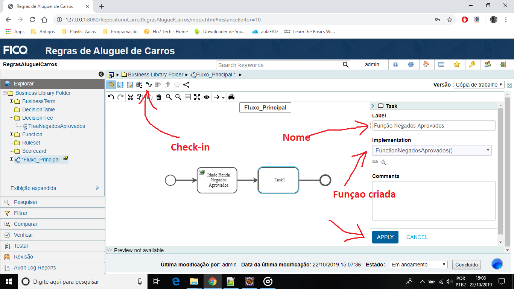

	------------------------	

## Testing

Até o momento, criamos apenas uma regra de negócio. Nosso programa deve analisar a idade e renda do cliente e retornar a sua aprovação ou reprovação. 

Para saber se tudo está correto até o momento, iremos fazer um teste. 

1. Gerando arquivo de teste. 
	- Clicar na aba Testar e ir em Decision Testing. 

	-------------------------
	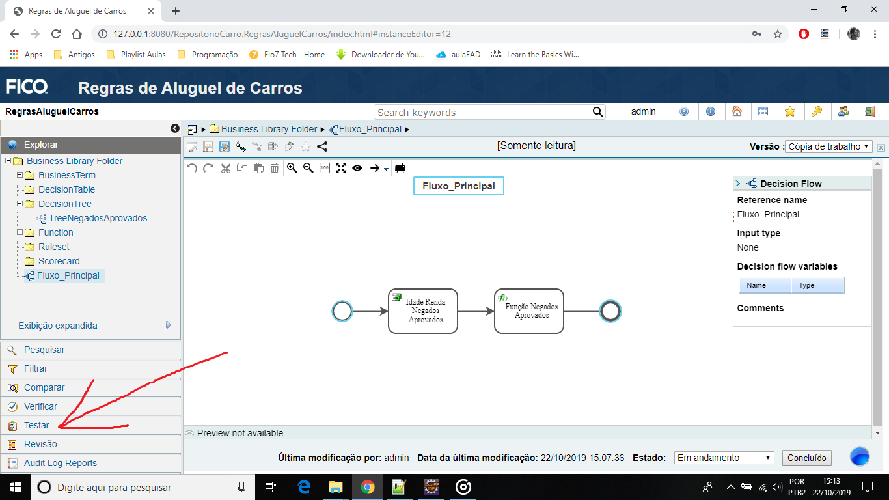

	------------------------

	- Selecionar a opção Test.
	- Selecionar a opção Entrypoint(DecisionInput): DecisionInput
	- Ir em **CONFIGURE DATA** para gerar um modelo de teste. 
	- Para gerar o modelo de teste, iremos utilizar as variáveis Age e Renda no input e Decision no Result. 
	- Clicar em Download para concluir. 

	-------------------------
	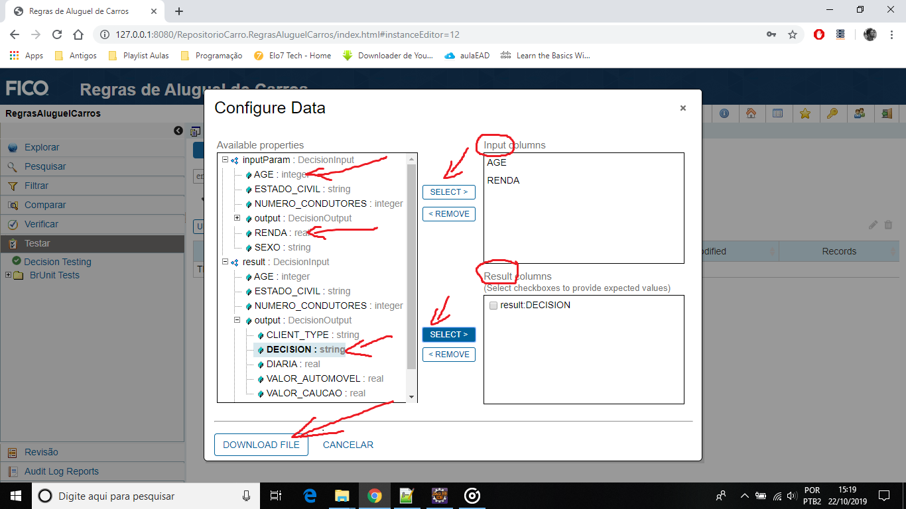

	------------------------
						
	- Ir na sua pasta de Downloads e abrir, no notepad++, o arquivo (inputdata.csv) que foi gerado.

	-------------------------
	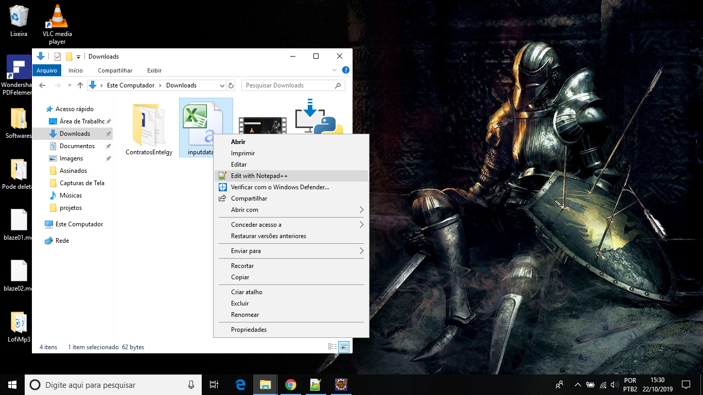

	------------------------
						
	- Você deve inserir as informações para testar:
		- Obs: os valores Result-State e Result-Detail não devem ser preenchidos, mas as vírgulas devem ser mantidas. O valor de result:DECISION também não deve ser preenchido. 
	------------------------
	- Seguir o exemplo abaixo:

	-------------------------
	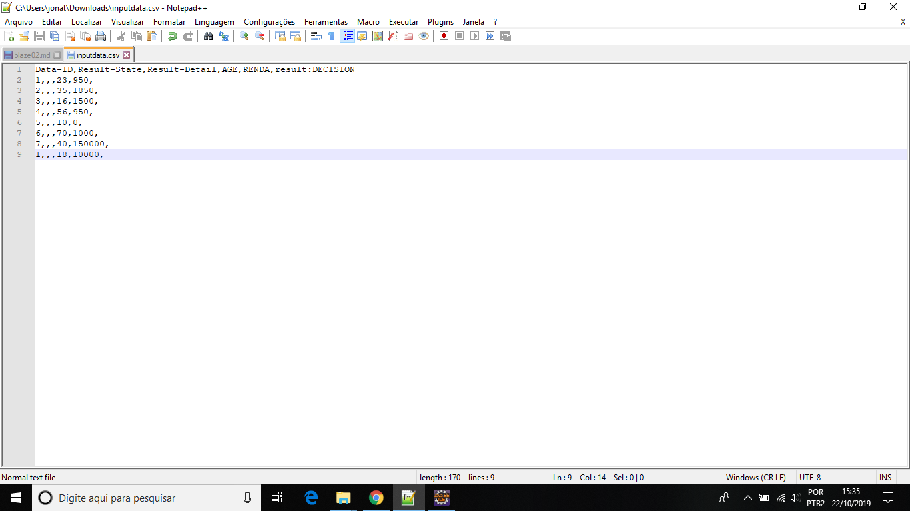

	------------------------

	- Salvar o arquivo na pasta **C:\Blaze\projetos\unit-tests**.
	- Caso não tenha esta pasta, basta criá-la e mover o arquivo para dentro dela. 

	------------------------

2. Testando a aplicação.
	- Agora que você tem o arquivo de teste com os dados a serem testados, basta clicar em UPLOAD DATA FILE e selecionar o arquivo de teste que criamos.
	- Lembrando que o arquivo deve estar na pasta C:\Blaze\projetos\unit-tests. O arquivo se chama **inputdata.csv**

	-------------------------
	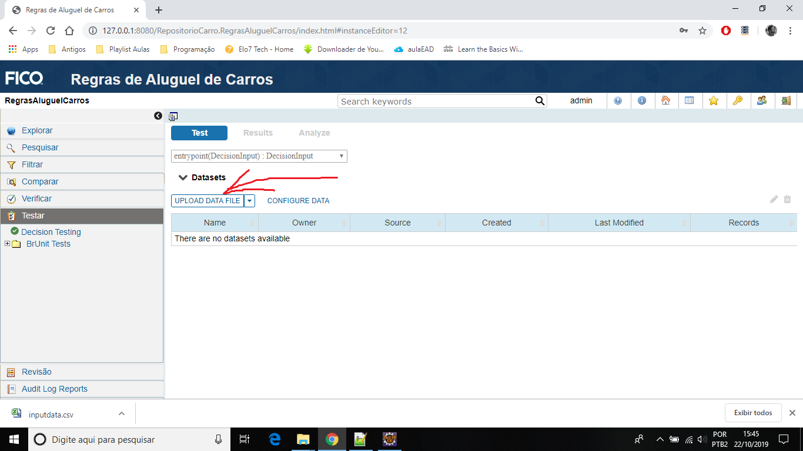

	------------------------
						
	- Ao carregar o arquivo, basta clicar em RUN TEST e esperar pelos resultados.

	-------------------------
	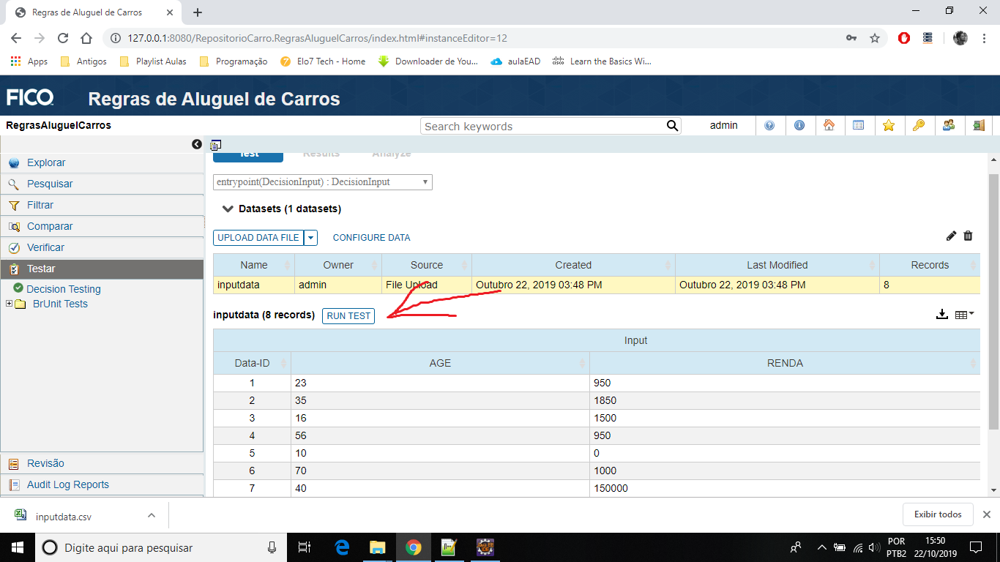

	------------------------ 
						
3. Resultados do teste.
	- Como podemos observar, todos os testes foram bem sucedidos. Todos os clientes que tinham menos de 18 anos e/ou renda inferior a R$ 1000 foram taxados como Negados e os demais como Aprovados. 
	- Esta foi uma simulação simples de aprovação para alugar carros. Muitas variáveis podem ser levadas em consideração. Modelos de decisão mais avançados serão discutidos nas próximas publicações. 

	-------------------------
	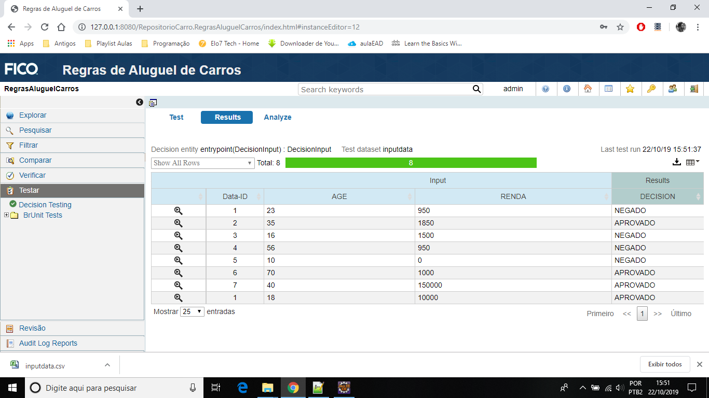

	------------------------

## Mais utoriais - Blaze

- 1 Introdução ao Blaze <button onclick="window.open('https://jonathan-geo.github.io/mkdocs/BLAZE/blaze01/');">Blaze - Instalações</button>

- 3 Deploy no Tomcat - <button onclick="window.open('https://jonathan-geo.github.io/mkdocs/BLAZE/blaze02/');">Blaze - Deploy</button>

- 4 Tópicos avançados - Em construção.

Elaborado por:
 
Jonathan Cardoso Lopes Domingos
 
21/10/2019

