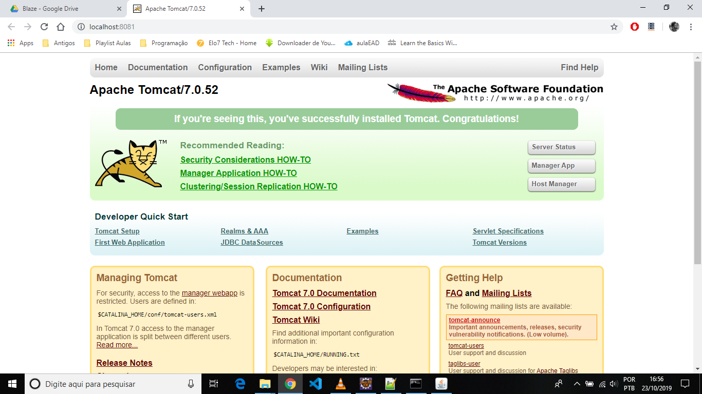
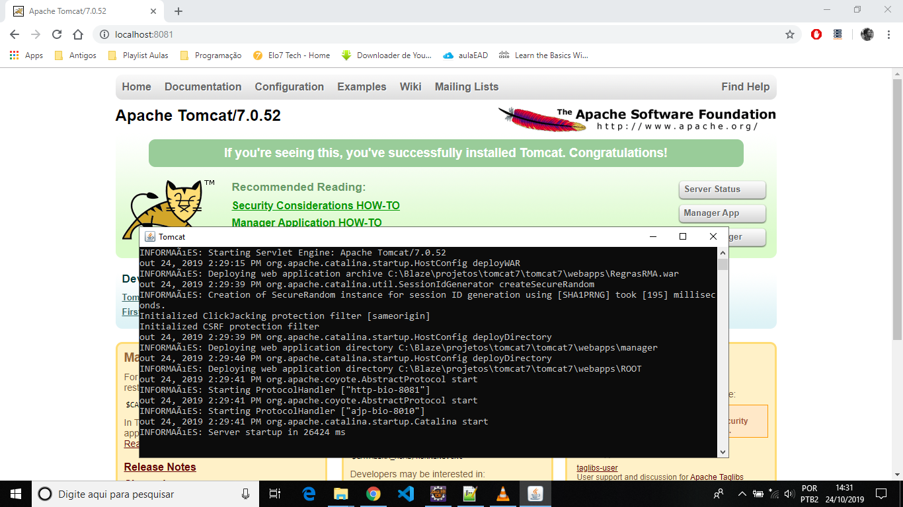

# Deploy Toncat7

Assim como nos tutoriais anteriores, os arquivos para instalação se encontram no seguinte repositório: <button onclick="window.open('https://drive.google.com/drive/folders/1XjpXLq40dpZurVS4NesaBRvp3_zAlgFl?usp=sharing');">REPOSITÓRIO</button>

Para iniciar este tutorial, você precisará baixar uma pasta em formato zip que está no drive.

>tomcat7.zip

Após o download, você deverá descompactar os arquivos dentro da pasta **C:\Blaze\projetos** que criamos em tutoriais anteriores. Seus arquivos descompactados devem ficar assim:

>C:\Blaze\projetos\tomcat7

-------------------------

------------------------

## Configurando o StartServer.bat

Este arquivo serve para facilitar o serviço de deploy no tomcat. 

- Abrir o arquivo startServer.bat com o notepad++.

-------------------------

------------------------

- O comando **set JAVA_HOME=C:\Progra~1\Java\jdk1.8.0_211** deve estar apontando para o jdk que está no seu pc. No caso do meu pc, o jdk está no endereço: **C:\Program Files\Java\jdk1.8.0_221**.

	- Substituir o endereço no arquivo StartServer.

- O comando **set CATALINA_HOME=C:\Blaze\training\tomcat7** também deve ser alterado. Ele deve estar apontando para a pasta tomcat7 que você acabou de descompactar na pasta projetos. 

	- Obs: a pasta tomcat7 pode estar dentro de outra pasta tomcat7, a depender do modo como foi descompactada. 

	- Substituir o endereço no arquivo StartServer.

- O comando **start C:\Blaze\training\tomcat7\bin\startup.bat** também deve estar referenciado corretamente. Referenciar como: **start C:\Blaze\projetos\tomcat7\tomcat7\bin\startup.bat**.
	
- A imagem a seguir mostra como ficaram as alterações.

- Não se esqueça de salvar estas alterações.

-------------------------

------------------------

- Após as alterações de endereço, dê um duplo clique sobre o arquivo startServer e o tomcat7 irá rodar no http://localhost:8081/ 

-------------------------

------------------------

-------------------------

------------------------

## Gerar um .WAR [Eclipse]

Agora iremos gerar um arquivo WAR (**W**eb Application **AR**chive). Este é um arquivo que permite a aplicação WEB do nosso projeto. 

- Primeiro você deve criar uma pasta chamada RMA dentro da pasta projetos. 

-------------------------

------------------------

- Abrir o Eclipse.
	- Selecionar o nosso projeto (RegrasAluguelCarros).
	- Ir na aba Project.
		- Generate Rule Maintenance Application.
		- Mudar o RMA Deployment para Eclipse Web Project and WAR.
		- Eclipse Web Project name:
			- RegrasRMA (ou pode deixar o nome que o Blaze recomenda).
			
		------------------------	
		
		- Marcar a opção: Generate War.
		- O caminho do War:
			- War File Location:
				- Pasta RMA que criamos. No meu caso, ficou assim: C:\Blaze\projetos\rma.
				
			-------------------------
			

			------------------------	
		
		- Next - Selecionar o projeto - Next - Selecionar o .jar - Finish.
		
			-------------------------
			

			------------------------
		
- Após concluir estes passos, o Blaze (Eclipse) irá gerar um arquivo .WAR [**RegrasRMA.war**] na sua pasta RMA. (Isso pode levar algum tempo, dependendo de seu computador). 

	-------------------------
	

	------------------------

- Além do arquivo .WAR, será gerado também um projeto no seu Eclipse. 
	- Clicar com o botão direito do mouse e fechar este projeto. (Close Project)

	-------------------------
	

	------------------------

## Executar o projeto .WAR [Toncat7]

Agora iremos executar, no tomcat, o projeto **RegrasRMA.war** que está dentro da pasta RMA.

- Rodar o servidor tomcat (caso não esteja rodando).
	- Duplo clique sobre o arquivo StartServer.bat que está na pasta C:\Blaze\projetos\tomcat7.
	- O tomcat7 irá rodar no http://localhost:8081/ 

- Após certificar-se de que o servidor tomcat está ativo no localhost 8081, basta ir na pasta RMA e copiar o arquivo **RegrasRMA.war** para a pasta webapps [**C:\Blaze\projetos\tomcat7\tomcat7\webapps**]

	-------------------------
	

	------------------------

- Se o servidor tomcat estiver ativo, o arquivo **RegrasRMA.war** será descompactado automaticamente (isso pode levar algum tempo, a depender do seu computador).

	-------------------------
	

	------------------------

- Após executar todo o processo de gerar o arquivo.WAR e descompactá-lo na pasta webapps do tomcat, basta ir no navegador que o tomcat está rodando, digitar o nome do projeto [**RegrasRMA**] após a porta 8081 e apertar enter para carregar a página, como na imagem abaixo. 

-------------------------

------------------------

- Isso irá gerar o RMA do Blaze no tomcat7, sem a necessidade de estar embarcado no Eclipse. Basta logar e começar a criar suas regras de negócio. 

-------------------------

------------------------

## Deploy [Rule Server] - Configurações 

Agora, de fato, iremos gerar um Deploy de serviço de regras, isto é, iremos gerar uma aplicação pronta para ser executada. 

- Primeiro, você deverá criar uma pasta com o nome de RuleServer dentro da pasta projetos. 

- Ir no Eclipse:
	- Pasta Deploy (você deverá criar três arquivos de configuração).

1. Primeiro arquivo de configuração: [**Rule Service Definition**]
	- Clicar com o botão direito do mouse sobre a pasta Deploy.
	- New - Deployment Entities - Rule Service Definition.

		-------------------------
		

		------------------------

		-------------------------
		

		------------------------
	
	- Manter o mesmo nome, porém sem os espaços e caracteres especiais. Observe o exemplo abaixo:
	
		-------------------------
		

		------------------------

	- Na aba de DefinicaoDoServicoDeRegras, vá em Add... [adicionar...] 
		- Em Functional Item [Item Funcional], escolha a opção **entrypoint(decisionInput):DecisionInput**
		
		-------------------------
		

		------------------------

		-------------------------
		

		------------------------
		
		- Salvar e fazer o Check-in. 
		

2. Segundo arquivo de configuração: [**Deployment Definition**]
	- Clicar com o botão direito do mouse sobre a pasta Deploy.
	- New - Deployment Entities - Deployment Definition.

		-------------------------
		

		------------------------	
	
	- Manter o mesmo nome, porém sem os espaços e caracteres especiais. Observe o exemplo abaixo:

		-------------------------
		

		------------------------	
		
		
	- Na aba de DefinicaoDeImplementacao, em Plataforma de Destino, escolha a opção **Java POJO Web Service**.
	
		
		-------------------------
		

		------------------------	
		
	- Salvar e fazer o Check-in. 	
	

3. Terceiro arquivo de configuração:
	- Clicar com o botão direito do mouse sobre a pasta Deploy.
	- New - Deployment Entities - System Definition.
		-------------------------
		

		------------------------
		
	- Manter o mesmo nome, porém sem os espaços e caracteres especiais [DefinicaoDoSistema].
	- Na aba de DefinicaoDoSistema:
		- Em Plataforma de Destino, escolha a opção **Java POJO Web Service**.
		- Em Fornecedor, escolha a opção **Tomcat8 and later**.
	
	
		-------------------------
		

		------------------------
	
	- Salvar e fazer o Check-in. 	
	
		
		
## Deploy [Rule Server] - Gerando Arquivos

- Copiar o caminho da pasta ruleserver que você criou. No meu caso, a pasta está em: C:\Blaze\projetos\ruleserver.
- Ir no Eclipse, selecionar o projeto principal e ir na aba Project:
	- Generate Rule Service Deployment [Gerar Implementação de Serviço de Regras]
	- Obs: o Eclipse irá encontrar as configurações que acabamos de fazer. [Tópico - Deploy [Rule Server] - Configurações].
	- Next - Next - Selecionar ou colar o caminho da pasta ruleserver - Next.
	
	-------------------------
	

	------------------------
	
	
	- Nesta parte, basta observar se os arquivos selecionados são do tipo aquivo.bat
		- Para deploy em Linux, os arquivos devem ser arquivo.sh
		- Finish.
		
		-------------------------
		

		------------------------

		-------------------------
		

		------------------------

		
	- Ao abrir a pasta ruleserver, você poderá observar alguns arquivos lá. 
	
	
		-------------------------
		

		------------------------	

	- Obs: o arquivo DeploymentDocumentation.html é uma documentação que guia o processo de deploy. 

## Deploy [Rule Server]

Agora iremos configurar alguns arquivos que foram gerados pelo processo anterior, na pasta Server. Lembrando que esta pasta se encontra dentro da pasta ruleserver. 

-------------------------

------------------------

1. Configurando o Script [Setenv].
	- Ir na pasta ruleserver/server.
	- Abrir o arquivo Setenv.bat com o notepad++
		- Você deve referenciar corretamente os caminhos de:
			- **TOMCAT_HOME=C:\apache-tomcat-8.5.24** e **JAVA_HOME=C:\Java\jdk**
			- Observe a imagem a seguir:
			
				-------------------------
				

				------------------------
				
			- Acrescentar o seguinte código na linha 99 [**set CLASSPATH=%CLASSPATH%;C:\Blaze\projetos\bom-Carro3.jar;**]
			- OBS: Este (C:\Blaze\projetos\bom-Carro3.jar) é o caminho do meu arquivo.jar
			- Salvar as alterações
			
				-------------------------
				

				------------------------
				
				
2. Configurando o Script [War.bat]
	- Abrir o arquivo War.bat no notepad++
	- Na linha 58, adicionar o código descrito na imagem abaixo. Atenção: o caminho que digitei é o caminho do meu arquivo bom-Carro3.jar
	- Salvar as alterações.
		-------------------------
		

		------------------------	
			

> Não se esqueça de salvar as alterações!

3. Rodando o Script [Setenv]
	- Ir na pasta ruleserver/server.
	- Digitar cmd na barra de caminhos e apertar enter.
		- Isso irá abrir o cmd na pasta server.
		
			-------------------------
			

			------------------------

		- Basta digitar Setenv.bat e pressionar enter para executar o arquivo que acabamos de configurar. 

			-------------------------
			

			------------------------
			
			-------------------------
			

			------------------------				

4. Rodando o Script [Build.bat]
	- Ainda no cmd do windows (deve ser na mesma janela que você digitou o Server.bat)
		- Digite Build.bat e aperte enter.
		- Este comando irá compilar algumas classes. 
			-------------------------
			

			------------------------

5. Rodando o arquivo [War.bat]
	- Ainda no cmd do windows (Deve ser na mesma janela que você digitou o Server.bat e Build.bat)
		- Digite War.bat e aperte enter.

			-------------------------
			

			------------------------

	- Este comando irá gerar uma série de arquivos, inclusive um arquivo.war dentro da pasta C:\Blaze\projetos\ruleserver\server\build. Para este projeto, o nome do arquivo ficou como: **DefinicaoDoServicoDeRegrasServer.war**
	- Este .war é o nosso ruleserver. Ele que vai gerar um up server no tomcat. 
	- Fechar o cmd.

## Gerando uma aplicação Toncat 

- Startar o Toncat7 pelo arquivo **startServer.bat** (dando um duplo clique) que está na pasta **C:\Blaze\projetos\tomcat7**
		
	-------------------------
	

	------------------------
		
	- Copiar o arquivo.war [**DefinicaoDoServicoDeRegrasServer.war**] da pasta **C:\Blaze\projetos\ruleserver\server\build** para a pasta **C:\Blaze\projetos\tomcat7\tomcat7\webapps**
	- Se tudo estiver correto, o arquivo **DefinicaoDoServicoDeRegrasServer.war** irá se descompactar automaticamente gerando uma pasta de mesmo nome. 
	
		-------------------------
		

		------------------------
	
	- Ir na pasta C:\Blaze\projetos\ruleserver e abrir o arquivo DeploymentDocumentation.html dando um duplo clique sobre ele. 
	
	-------------------------
	

	------------------------

	- Procurar e copiar o seguinte link WSDL: 
	
	> http://localhost:8080/DefinicaoDoServicoDeRegrasServer/DefinicaoDoServicoDeRegrasService?wsdl
		
	-------------------------
	

	------------------------
	
	- Colar o link em seu navegador. 
	- Obs: trocar a porta 8080 por 8081. 
	- O link ficará assim: 
	
	> http://localhost:8081/DefinicaoDoServicoDeRegrasServer/DefinicaoDoServicoDeRegrasService?wsdl
	
	- Se tudo ocorreu bem, sua aplicação retornará um XML assim:
	
	-------------------------
	

	------------------------
	
	
## Testando a Aplicação no SoapUI

- Criar uma pasta [workspaceSoap] dentro da pasta Projetos.

	-------------------------
	

	------------------------

- Instalar o SoapUI
	- Baixe o SoapUI [SoapUI-x32-5.5.0.exe] do Repositório que disponibilizei: <button onclick="window.open('https://drive.google.com/drive/folders/1XjpXLq40dpZurVS4NesaBRvp3_zAlgFl?usp=sharing');">REPOSITÓRIO</button>
	- Duplo clique sobre o executável e ir dando next. 
	- O SoapUI abrirá sua janela inicial.
		
	-------------------------
	

	------------------------
	
	-------------------------
	

	------------------------
		
- No SoapUI, vá em:
	- File - New Workspace - dar o nome de workspaceSoap 
			
	-------------------------
	

	------------------------
	
	- Escolher a pasta workspaceSoap que criamos dentro da pasta Projetos.
	
	-------------------------
	

	------------------------
	
	- Salvar.

	------------------------

- Ainda no SoapUI:
	- File - New Soap Project.
		
	-------------------------
	

	------------------------
		
	- Atenção: colar o link WSDL que geramos para o tomcat anteriormente: 
	
	>http://localhost:8081/DefinicaoDoServicoDeRegrasServer/DefinicaoDoServicoDeRegrasService?wsdl

	- O nome do projeto será gerado automaticamente. 
		
	-------------------------
	

	------------------------
	
- O Soap importará o serviço e gerará um request. [entrypoint]
		- Clicando no arquivo: entrypoint/Request1 teremos uma comunicação com a aplicação. Basta digitar os dados do cliente no lugar das interrogações (?) e teremos o output dos dados inseridos. 
		- Para isso, basta digitar os dados e ir no ícone Rodar. 
		
-------------------------

------------------------
		
## Considerações finais

Como você podê ver, nossa aplicação é bem simples e apresenta várias inconsistências como, por exemplo, possuir dados que não estão sendo utilizados. 
Mas nosso objetivo era apenas introduzir o Blaze. 

Esta aplicação recebe dois valores principais (idade e renda) e retorna Negado caso a idade seja menor do que 18 ou a renda menor do que R$ 1000. Ou seja, não estão aptos a alugar um carro. 
No exemplo acima, a idade é de 22 anos e a renda é de R$ 5420, ou seja, é um cliente apto a alugar um carro. 	
Já no exemplo abaixo, a idade é de 16 e a renda de R$ 5420. Mesmo a renda sendo maior do que R$ 1000, o resultado é Negado, pois a idade é menor do que 18. 
-------------------------

------------------------
		
## Mais utoriais - Blaze

- 1 Introdução ao Blaze <button onclick="window.open('https://jonathan-geo.github.io/mkdocs/BLAZE/blaze01/');">Blaze - Instalações</button>

- 2 Utilizando o RMA - <button onclick="window.open('https://jonathan-geo.github.io/mkdocs/BLAZE/blaze02/');">Blaze - Utilização</button>

- 4 Tópicos avançados - Em construção.

Elaborado por:
 
Jonathan Cardoso Lopes Domingos
 
21/10/2019		
		
		
		