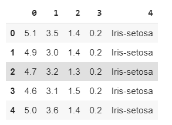
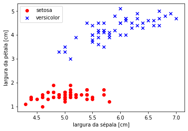

# MODELO PERCEPTRON

Neste tutorial iremos elaborar um modelo de aprendizagem **Supervisionada** chamado perceptron simples. Iremos utilizar os dados do dataset iris, mais especificamente os dados de duas tipagem de plantas, a Iris Setosa e a Iris versicolor.Estamos utilizando dois dados de saída pois iremos fazer uma análise de classificação linear simples, ou seja, com a função de ativação degrau bipolar. Como estamos utilizando um regressão simples, iremos utilizar apenas duas características de entradas de dados. Comprimento da Sepala e Comprimento da Petala.


**Modelo:**


** Iris Data Set - Informações dos dados:**

0. sepal length in cm = Comprimento da Sepala
1. sepal width in cm  = Largura da Sepala
2. petal length in cm = Comprimento da Petala
3. petal width in cm  = Larguta da Petala

4. class:
-- Iris Setosa
-- Iris Versicolour
-- Iris Virginica

## Manipulando os Dados

```python
In [01]: import numpy as np
		 import pandas as pd
		 import matplotlib.pyplot as plt
		 from sklearn import model_selection

# Carregando o conjunto iris dataset do link oficial
In [02]: dataIris = pd.read_csv('https://archive.ics.uci.edu/ml/'
						'machine-learning-databases/iris/iris.data', header=None)

In [03]: dataIris[:5]
Out[03]:
```

-------------------------


------------------------


```python
In [04]: dataIris.shape
Out[04]:
		(150, 5)

# Obtendo o vetor de alvos [y]  Iris Setosa e Iris versicolor. 
In [05]: y = dataIris.iloc[0:100, 4].values	
In [06]: y	
Out[06]:
    array(['Iris-setosa', 'Iris-setosa', 'Iris-setosa', 'Iris-setosa',
           'Iris-setosa', 'Iris-setosa', 'Iris-setosa', 'Iris-setosa',
           'Iris-setosa', 'Iris-setosa', 'Iris-setosa', 'Iris-setosa',
           'Iris-setosa', 'Iris-setosa', 'Iris-setosa', 'Iris-setosa',
           'Iris-setosa', 'Iris-setosa', 'Iris-setosa', 'Iris-setosa',
           'Iris-setosa', 'Iris-setosa', 'Iris-setosa', 'Iris-setosa',
           'Iris-setosa', 'Iris-setosa', 'Iris-setosa', 'Iris-setosa',
           'Iris-setosa', 'Iris-setosa', 'Iris-setosa', 'Iris-setosa',
           'Iris-setosa', 'Iris-setosa', 'Iris-setosa', 'Iris-setosa',
           'Iris-setosa', 'Iris-setosa', 'Iris-setosa', 'Iris-setosa',
           'Iris-setosa', 'Iris-setosa', 'Iris-setosa', 'Iris-setosa',
           'Iris-setosa', 'Iris-setosa', 'Iris-setosa', 'Iris-setosa',
           'Iris-setosa', 'Iris-setosa', 'Iris-versicolor', 'Iris-versicolor',
           'Iris-versicolor', 'Iris-versicolor', 'Iris-versicolor',
           'Iris-versicolor', 'Iris-versicolor', 'Iris-versicolor',
           'Iris-versicolor', 'Iris-versicolor', 'Iris-versicolor',
           'Iris-versicolor', 'Iris-versicolor', 'Iris-versicolor',
           'Iris-versicolor', 'Iris-versicolor', 'Iris-versicolor',
           'Iris-versicolor', 'Iris-versicolor', 'Iris-versicolor',
           'Iris-versicolor', 'Iris-versicolor', 'Iris-versicolor',
           'Iris-versicolor', 'Iris-versicolor', 'Iris-versicolor',
           'Iris-versicolor', 'Iris-versicolor', 'Iris-versicolor',
           'Iris-versicolor', 'Iris-versicolor', 'Iris-versicolor',
           'Iris-versicolor', 'Iris-versicolor', 'Iris-versicolor',
           'Iris-versicolor', 'Iris-versicolor', 'Iris-versicolor',
           'Iris-versicolor', 'Iris-versicolor', 'Iris-versicolor',
           'Iris-versicolor', 'Iris-versicolor', 'Iris-versicolor',
           'Iris-versicolor', 'Iris-versicolor', 'Iris-versicolor',
           'Iris-versicolor', 'Iris-versicolor', 'Iris-versicolor'],
          dtype=object)
	
```


```python
In [07]: y.shape
Out[07]:
		(100,)

#Atribuindo um rótulo (numérico) as saídas. 
#Iris Setosa == -1 e Iris versicolorm 1. 
In [08]: y = np.where(y == 'Iris-setosa', -1, 1)
In [09]: y
Out[09]:
		array([-1, -1, -1, -1, -1, -1, -1, -1, -1, -1, -1, -1, -1, -1, -1, -1, -1,
				   -1, -1, -1, -1, -1, -1, -1, -1, -1, -1, -1, -1, -1, -1, -1, -1, -1,
				   -1, -1, -1, -1, -1, -1, -1, -1, -1, -1, -1, -1, -1, -1, -1, -1,  1,
					1,  1,  1,  1,  1,  1,  1,  1,  1,  1,  1,  1,  1,  1,  1,  1,  1,
					1,  1,  1,  1,  1,  1,  1,  1,  1,  1,  1,  1,  1,  1,  1,  1,  1,
					1,  1,  1,  1,  1,  1,  1,  1,  1,  1,  1,  1,  1,  1,  1])

```

```python
#Separendo a variável de entrada do modelo. Comprimento da sepala e da petala.
In [10]: x = dataIris.iloc[0:100, [0, 2]].values

In [11]: x[0:10]
Out[11]:
		array([[5.1, 1.4],
				   [4.9, 1.4],
				   [4.7, 1.3],
				   [4.6, 1.5],
				   [5. , 1.4],
				   [5.4, 1.7],
				   [4.6, 1.4],
				   [5. , 1.5],
				   [4.4, 1.4],
				   [4.9, 1.5]])
```

```python
# Adicionando a coluna do bias (necessário em algoritmos baseados em perceptron/gradiente)
In [12]: x = np.c_[np.ones(x.shape[0]), x]

In [13]: x[0:10]
Out[13]:
		array([[1. , 5.1, 1.4],
				   [1. , 4.9, 1.4],
				   [1. , 4.7, 1.3],
				   [1. , 4.6, 1.5],
				   [1. , 5. , 1.4],
				   [1. , 5.4, 1.7],
				   [1. , 4.6, 1.4],
				   [1. , 5. , 1.5],
				   [1. , 4.4, 1.4],
				   [1. , 4.9, 1.5]])


In [14]: x.shape
Out[14]:
		(100, 3)
```


```python
# Visualizando os dados (estamos pulando a coluna do bias)
In [15]: plt.scatter(x[:50, 1], x[:50, 2],
					color='red', marker='o', label='setosa')

		plt.scatter(x[50:100, 1], x[50:100, 2],
					color='blue', marker='x', label='versicolor')

		plt.xlabel('largura da sépala [cm]')
		plt.ylabel('largura da pétala [cm]')
		plt.legend(loc='upper left') 
		plt.show()
Out[15]:
```

-------------------------


------------------------


```python
#Dividindo o dataset em treino e teste. 
In [16]: x_train, x_test, y_train, y_test = model_selection.train_test_split(x, y, test_size=0.2, random_state=0)

In [17]: x_train[:5]
Out[17]:
		array([[1. , 5. , 1.6],
			   [1. , 6. , 4. ],
			   [1. , 4.6, 1.5],
			   [1. , 6.1, 4. ],
			   [1. , 4.8, 1.4]])


In [18]: x_train.shape
Out[18]: 
		(80, 3)

In [19]: y_train
Out[19]:
		array([-1,  1, -1,  1, -1, -1, -1,  1,  1,  1,  1,  1,  1,  1,  1, -1, -1,
            1,  1,  1, -1,  1, -1, -1, -1, -1, -1, -1, -1, -1,  1,  1, -1, -1,
           -1,  1, -1, -1, -1,  1, -1, -1,  1,  1,  1,  1, -1,  1, -1,  1, -1,
           -1, -1,  1,  1,  1, -1,  1,  1,  1, -1, -1,  1, -1, -1,  1,  1, -1,
            1,  1,  1, -1, -1,  1, -1,  1,  1,  1, -1, -1])


In [20]: y_train.shape
Out[20]:
		(80,)
```

## Funçã (Ativação) - Somatória

```python
#Função do ŷ ou h
In [21]: def h(x, thetas):
			#A função dot faz multiplicação de matriz
			#x.dot(thetas) é o mesmo que Σ(Xi.Wi)
			#a função where faz o papel da função degrau. Se o 
			#output de x.dot(thetas) for maior que 0.0 retorne 1
			#se for menor retorne -1. 
			return np.where(x.dot(thetas) >= 0.0, 1, -1)
```

## Fução de Pesos 

```python
In [22]: def perceptron(x, y, iterations, alpha):
			#Definindo os pesos = array([0., 0., 0.])
			thetas = np.zeros(x_train.shape[1])
			#Repetir por dez vezes
			for i in range(iterations):
				#Para cada entrada x e saída y. 
				for xi, yi in zip(x_train, y_train):
					#Fórmula do perceptron para ajuste dos pesos
					# [w = w + α * Et . xi]
					# [Et = yi - ŷ]  para ŷ = h 
					# ŷ ou h (é o y estimado, ou seja, )
					thetas = thetas + alpha * (yi - h(xi, thetas)) * xi
			return thetas
```

## Treinando Modelo: Obtenção de pesos

```python
# Treinando nosso modelo...
#Iterações
In [23]: iterations = 10 
#Coef-Aprend
In [24]: alpha = 0.01
#Chamada-Func
#Thetas é o mesmo que pesos ou w
In [25]: thetas = perceptron(x_train, y_train, iterations, alpha)
```


```python
#Pesos de W balanceados. (Equação da reta)
In [26]: thetasFinal = thetas
In [27]: print(thetasFinal)
Out[27]:
		[-0.04  -0.112  0.216]
```

    
## Testando Modelo: Predição de valores


```python
In [28]: x_test.shape
Out[28]:
		(20, 3)

In [29]: x_test
Out[29]:
		array([[1. , 5. , 1.6],
           [1. , 6.7, 4.7],
           [1. , 4.7, 1.3],
           [1. , 5.7, 4.5],
           [1. , 6.6, 4.4],
           [1. , 5. , 3.3],
           [1. , 5.4, 1.3],
           [1. , 6.1, 4.7],
           [1. , 6.5, 4.6],
           [1. , 5.7, 4.2],
           [1. , 5.5, 4. ],
           [1. , 5.8, 4. ],
           [1. , 6. , 4.5],
           [1. , 4.3, 1.1],
           [1. , 5. , 1.5],
           [1. , 4.8, 1.6],
           [1. , 4.6, 1. ],
           [1. , 4.8, 1.9],
           [1. , 5.5, 1.4],
           [1. , 4.4, 1.4]])

In [30]: y_test
Out[30]:
		array([-1,  1, -1,  1,  1,  1, -1,  1,  1,  1,  1,  1,  1, -1, -1, -1, -1,
           -1, -1, -1])
```

** Função Ativação - Teste**

```python
#Teste
In [31]: def hFinal(x_test, thetasFinal):
			return np.where(x_test.dot(thetasFinal) >= 0.0, 1, -1)

In [32]: y_est = hFinal(x_test, thetasFinal)

In [33]: y_est == y_test
Out[33]:
		array([ True,  True,  True,  True,  True,  True,  True,  True,  True,
            True,  True,  True,  True,  True,  True,  True,  True,  True,
            True,  True])

```

## Deletando colunas de uma matriz(array) numpay. 

```
import numpy as np

a = np.arange(12).reshape(3, 4)
print(a)
# [[ 0  1  2  3]
#  [ 4  5  6  7]
#  [ 8  9 10 11]]

print(np.delete(a, 1, 0))
# [[ 0  1  2  3]
#  [ 8  9 10 11]]

print(np.delete(a, 1, 1))
# [[ 0  2  3]
#  [ 4  6  7]
#  [ 8 10 11]]

# print(np.delete(a, 1, 2))
# AxisError: axis 2 is out of bounds for array of dimension 2
```

## Referencias:

- Python Machine Learn - Sebastian Raschka https://www.amazon.com.br/Python-Machine-Learning-Sebastian-Raschka/dp/1789955750/ref=pd_sbs_14_t_0/146-7290337-7783406?_encoding=UTF8&pd_rd_i=1789955750&pd_rd_r=5750d573-f6c1-4f84-acf3-a26698a9fa4c&pd_rd_w=RXeqA&pd_rd_wg=5MTyX&pf_rd_p=adb10074-dc46-4d48-9abd-ebbbd99776aa&pf_rd_r=5X5JXYVPCJ010JQ0EEV3&psc=1&refRID=5X5JXYVPCJ010JQ0EEV3

- http://wiki.icmc.usp.br/images/7/7b/Perceptron.pdf

- https://juliocprocha.blog/2017/07/27/perceptron-para-classificacao-passo-a-passo/

