# Web Scraping com Python - Ações do Bradesco

Elaborado por:
<br/>
Jonathan Cardoso Lopes Domingos
<br/>
02/01/2020

> O seguinte web screping é apenas um material de consulta rápida, aqui não apresenta nenhuma análise aprofundade sobre o assunto. 
Neste material apresento um scraping das ações do Bradesco. 

```python
# O modulo time aqui foi utilizado para esperar o carregamento das paginas atraves do firefox
# Este módulo não é necessário no jupyter lab
#import time

# o modulo Select sera utilizado para interagir com a caixa de selecao
In [1]: from selenium.webdriver.support.ui import Select

# modulo utilizado para webScreping Python
In [2]: from bs4 import BeautifulSoup

# o modulo webdriver e necessario para definir qual navegador sera utilizado para fazer a automacao
In [3]: from selenium import webdriver
```

### Executa o Navegador


```python
In [4]: from selenium.webdriver.firefox.firefox_binary import FirefoxBinary
In [5]: binary = FirefoxBinary("C:\\Program Files\\Mozilla Firefox\\firefox.exe")

# a linha abaixo define qual e o navegador que queremos utilizar.
In [6]: driver = webdriver.Firefox(firefox_binary=binary, executable_path=r'C:\\geckodriver.exe')
```

### Insere o endereço WEB


```python
# abaixo foi definido qual e o site que quero acessar
In [7]: driver.get("https://economia.uol.com.br/cotacoes/bolsas/acoes/bvsp-bovespa/bbdc4-sa")
```

### Manipulando a Página


```python
# Selecionando o botão que iremos clicar - (Listagem de dados)
In [8]: btn10 = driver.find_element_by_css_selector(".btn-mode > span:nth-child(2)")
```


```python
# Clicando no botão da página
In [9]: btn10.click()
```


```python
# Selecionando o botão que iremos clicar - (Histórico)
In [10]: btn20 = driver.find_element_by_css_selector(".btn-day > span:nth-child(2)")
```


```python
# Clicando no botão da página
In [11]: btn20.click()
```


```python
# Selecionando o botão que iremos clicar - (Ações/Ano)
In [12]: btn30 = driver.find_element_by_css_selector(".btn-day-table > span:nth-child(4)")
```


```python
# Clicando no botão da página
In [13]: btn30.click()
```

### Raspando os dados


```python
#Armazenando, por um "id", a tabela de dados da página em uma variável.
#.chart-body
In [14]: dados = driver.find_element_by_css_selector(".mod-table")
In [15]: dados
Out[15]:   
		<selenium.webdriver.firefox.webelement.FirefoxWebElement (session="52a04cdd-5f82-4051-927e-1ded929cbb24", element="748f7f99-dc8d-4f17-a9b6-c01dc555ea76")>
```

```python
#Pegando os atributos HTML do objeto armazenado na variavel dados.
In [16]: html = dados.get_attribute("innerHTML")

# Amostra dos atributos
In [17]: html
Out[17]:  
		'<div class="box-scroll"><div class="scroll" data-scroll="{&quot;breakpoints&quot;:[&quot;xs&quot;, &quot;sm&quot;, &quot;md&quot;, &quot;lg&quot;]}" uolbpack-initialized="true" tabindex="0" style="height: 428px;"><div class="scroll-content scroll-animate"><span class="scrollReset"></span><!-- ngIf: !error --><div class="charts-mod-table ng-scope" ng-if="!error" style="display: inline;">  <div class="chart-loading loading-history" style="display: none;"><div class="loading"> <svg width="100px" height="100px" xmlns="http://www.w3.org/2000/svg" viewBox="0 0 100 100" preserveAspectRatio="xMidYMid" class="loading uil-ring"><rect x="0" y="0" width="100" height="100" fill="none" class="bk"></rect><defs><filter id="uil-ring-shadow" x="-100%" y="-100%" width="300%" height="300%"><feOffset result="offOut" in="SourceGraphic" dx="0" dy="0"></feOffset><feGaussianBlur result="blurOut" in="offOut" stdDeviation="0"></feGaussianBlur><feBlend in="SourceGraphic" in2="blurOut" mode="normal"></feBlend></filter></defs><path d="M10,50c0,0,0,0.5,0.1,1.4c0,0.5,0.1,1,0.2,1.7c0,0.3,0.1,0.7,0.1,1.1c0.1,0.4,0.1,0.8,0.2,1.2c0.2,0.8,0.3,1.8,0.5,2.8 c0.3,1,0.6,2.1,0.9,3.2c0.3,1.1,0.9,2.3,1.4,3.5c0.5,1.2,1.2,2.4,1.8,3.7c0.3,0.6,0.8,1.2,1.2,1.9c0.4,0.6,0.8,1.3,1.3,1.9 c1,1.2,1.9,2.6,3.1,3.7c2.2,2.5,5,4.7,7.9,6.7c3,2,6.5,3.4,10.1,4.6c3.6,1.1,7.5,1.5,11.2,1.6c4-0.1,7.7-0.6,11.3-1.6 c3.6-1.2,7-2.6,10-4.6c3-2,5.8-4.2,7.9-6.7c1.2-1.2,2.1-2.5,3.1-3.7c0.5-0.6,0.9-1.3,1.3-1.9c0.4-0.6,0.8-1.3,1.2-1.9 c0.6-1.3,1.3-2.5,1.8-3.7c0.5-1.2,1-2.4,1.4-3.5c0.3-1.1,0.6-2.2,0.9-3.2c0.2-1,0.4-1.9,0.5-2.8c0.1-0.4,0.1-0.8,0.2-1.2 c0-0.4,0.1-0.7,0.1-1.1c0.........etc...
```


```python
#Transformando em objeto html para BS4. 
In [18]: soup = BeautifulSoup(html, "html.parser")

# Amostra dos atributos
In [19]: soup
Out[19]:
		<div class="box-scroll"><div class="scroll" data-scroll='{"breakpoints":["xs", "sm", "md", "lg"]}' style="height: 428px;" tabindex="0"uolbpack-initialized="true"><div class="scroll-content scroll-animate"><span class="scrollReset"></span><!-- ngIf: !error --><div class="charts-mod-table ng-scope" ng-if="!error" style="display: inline;"> <div class="chart-loading loading-history" style="display: none;"><div class="loading"> <svg class="loading uil-ring" height="100px" preserveaspectratio="xMidYMid" viewbox="0 0 100 100" width="100px" xmlns="http://www.w3.org/2000/svg"><rect class="bk" fill="none" height="100" width="100" x="0" y="0"></rect><defs><filter height="300%" id="uil-ring-shadow" width="300%" x="-100%" y="-100%"><feoffset dx="0" dy="0" in="SourceGraphic" result="offOut"></feoffset><fegaussianblur in="offOut" result="blurOut" stddeviation="0"></fegaussianblur><feblend in="SourceGraphic" in2="blurOut" mode="normal"></feblend></filter></defs><path d="M10,50c0,0,0,0.5,0.1,1.4c0,0.5,0.1,,0.2,1.7c0,0.3,0.1,0.7,0.1,1.1c0.1,0.4,0.1,0.8,0.2,1.2c0.2,0.8,0.3,1.8,0.5,2.8 c0.3,1,0.6,2.1,0.9,3.2c0.3,1.1,0.9,2.3,1.4,3.5c0.51.2,1.2,2.4,1.8,3.7c0.3,0.6,0.8,1.2,1.2,1.9c0.4,0.6,0.8,1.3,1.3,1.9 c1,1.2,1.9,2.6,3.1,3.7c2.2,2.5,5,4.7,7.9,6.7c3,2,6.5,3.4,10.14.6c3.6,1.1,7.5,1.5,11.2,1.6c4-0.1,7.7-0.6,11.3-1.6 c3.6-1.2,7-2.6,10-4.6c3-2,5.8-4.2,7.9-6.7c1.2-1.2,2.1-2.5,3.1-3.7c0.5-0.6,0.9-1.3,1.3-1.9c0.4-0.6,0.8-1.3,1.2-1.9 c0.6-1.3,1.3-2.5,1.8-3.7c0.5-1.2..................etc............
```


```python
#Filtrando os dados, deixando somente os dados que estão na tabela. 
In [20]: table = soup.select_one("table")

# Amostra dos atributos
In [21]: table
Out[21]:
		<table class="tabela-historic"><thead> <tr><th class="data">DATA</th><th class="compra">COTAÇÃO</th><th class="venda hidden-xs">VOLUME</th><th class="ultimapct hidden-xs"> </th><th class="ultima" colspan="2">VARIAÇÃO</th><th class="max hidden-xs hidden-sm hidden-md">MÁXIMO</th><th class="min hidden-xs hidden-sm hidden-md">MÍNIMO</th></tr> </thead><tbody><!-- ngRepeat: item in dataHistory.docs --><tr class="ng-scope" ng-repeat="item in dataHistory.docs"><td class="data ng-binding" ng-bind="item.date">26/12/2019 00:00</td><td class="compra ng-binding" ng-bind="item.bidvalue">36,36</td><td class="venda hidden-xs ng-binding" ng-bind="item.askvalue">10.453.500</td><td class="ultimapct ng-binding alta" ng-bind="(item.variationpercentbidView) + '%'" ng-class="{'alta': item.variationpercentbid &gt;= 0, 'baixa': item.variationpercentbid &lt; 0}">1,25%</td><td class="ultima hidden-xs ng-binding alta" ng-bind="item.variationbidView" ng-class="{'alta': item.variationbid &gt;= 0, 'baixa': item.variationbid &lt; 0}">0,45</td><td class="max hidden-xs hidden-sm hidden-md ng-binding" ng-bind="item.maxbid">36,49</td><td class="min hidden-xs hidden-sm hidden-md ng-binding" ng-bind="item.minbid">35,82</td></tr><!-- end ngRepeat: item in dataHistory.docs --><tr class="ng-scope" ng-repeat="item in dataHistory.docs"><td class="data ng-binding" ng-bind="item.date">23/12/2019 00:00</td><td class="compra ng-binding" ng-bind="item.bidvalue">35,91</td><td class="venda hidden-xs ng-binding" ng-bind="item.askvalue">10.267.900</td><td class="ultimapct ng-binding alta" ng-bind="(item.variationpercentbidView) + '%'" ng-class="{'alta': item.variationpercentbid &gt;= 0, 'baixa': item.var...................etc...............
```


### Cabeçalho da Tabela

**O objetivo é retirar os itens que fazem parte do header**

```html
<table class="tabela-historic">
<thead> 
<tr>
<th class="data">DATA</th>
<th class="compra">COTAÇÃO</th>
<th class="venda hidden-xs">VOLUME</th>
<th class="ultimapct hidden-xs"> </th>
<th class="ultima" colspan="2">VARIAÇÃO</th>
<th class="max hidden-xs hidden-sm hidden-md">MÁXIMO</th>
<th class="min hidden-xs hidden-sm hidden-md">MÍNIMO</th>
</tr> 
</thead
```


```python
#Armazenando os títulos das colunas da tabela em uma variável headers
In [22]: headers = [header.text for header in table.select("th")]
In [23]: headers
Out[23]:
		['DATA', 'COTAÇÃO', 'VOLUME', '\xa0', 'VARIAÇÃO', 'MÁXIMO', 'MÍNIMO']

```

### Corpo da Tabela

**O objetivo é retirar os itens que fazem parte do corpo da tabela**

```python
#Armazenando os dados da tabela em uma variável data1
In [24]: data1 = [d.text for d in table.select ("tbody > tr > td")]

#Imprimindo uma amostra dos primeiros 20 dados
#Descobrindo o padrão de 7
#A cada 7 dados a data se repete
In [25]: data1[:20]
Out[25]:
		['27/12/2019 00:00',
		 '36,22',
		 '10.404.000',
		 '-0,39%',
		 '-0,14',
		 '36,65',
		 '36,10',
		 '26/12/2019 00:00',
		 '36,36',
		 '10.453.500',
		 '1,25%',
		 '0,45',
		 '36,49',
		 '35,82',
		 '23/12/2019 00:00',
		 '35,91',
		 '10.267.900',
		 '0,62%',
		 '0,22',
		 '35,92']
```

```python
#Imprimindo o total de dados
In [26]: len(data1)
Out[26]: 1729
 
#Achando o número de grupo(linhas) do dataset
In [27]: len(data1)/7
Out[27]: 247.0
 
In [28]: print(data1[0])
Out[28]: 27/12/2019 00:00

In [29]: print(data1[1])
Out[29]: 36,22 
    
```


### Organizando a Matriz   

**O objetivo é organizar os dados para transformar uma matriz em um dataFrame(Tabela Python)**

```python
#Dividindo a lista de dados extraídos da tabela em sublistas
In [30]:    n = 247
			splited = []
			len_l = len(data1)
			for i in range(n):
				start = int(i*len_l/n)
				end = int((i+1)*len_l/n)
				splited.append(data1[start:end])
```


```python
#Imprimindo os 5 primeiros conjuntos. 
#Observar se o grupo corresponde a primeira linha do dataset no site.
In [31]: splited[:5]
Out[31]:
		[['27/12/2019 00:00',
			  '36,22',
			  '10.404.000',
			  '-0,39%',
			  '-0,14',
			  '36,65',
			  '36,10'],
			 ['26/12/2019 00:00',
			  '36,36',
			  '10.453.500',
			  '1,25%',
			  '0,45',
			  '36,49',
			  '35,82'],
			 ['23/12/2019 00:00',
			  '35,91',
			  '10.267.900',
			  '0,62%',
			  '0,22',
			  '35,92',
			  '35,48'],
			 ['20/12/2019 00:00',
			  '35,69',
			  '22.379.200',
			  '-0,78%',
			  '-0,28',
			  '35,93',
			  '35,46'],
			 ['19/12/2019 00:00',
			  '36,45',
			  '32.951.700',
			  '1,84%',
			  '0,66',
			  '36,45',
			  '35,68']]

```

```python
#Fazer alteração no array de header
In [32]: headers
Out[32]:
		['DATA', 'COTAÇÃO', 'VOLUME', '\xa0', 'VARIAÇÃO', 'MÁXIMO', 'MÍNIMO']
		
#Corrigindo o título da tabela '\xa0' --> VARIAÇÃO-%
In [33]: headers[3]="VARIAÇÃO(%)"
In [34]: headers
Out[34]:
		['DATA', 'COTAÇÃO', 'VOLUME', 'VARIAÇÃO(%)', 'VARIAÇÃO', 'MÁXIMO', 'MÍNIMO']

```

### Matriz para DataFrame  

```python
In [35]: import pandas as pd
In [36]: import numpy as np
```


```python
# Transformando a lista de dados e títulos em um dataFrame. 
In [37]: df = pd.DataFrame(np.array(splited).reshape(247,7), columns = list(headers))
In [37]: df
Out[37]:
```
-------------------------
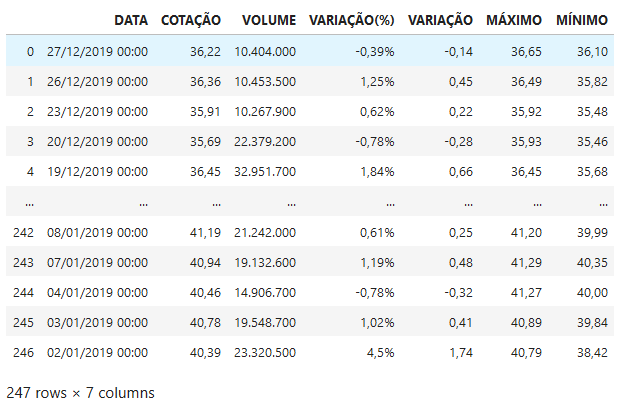

------------------------


### Preperando os dados


```python
In [38]: df.shape
Out[38]:(247, 7)

In [39]: df.dtypes
Out[39]:
		DATA           object
		COTAÇÃO        object
		VOLUME         object
		VARIAÇÃO(%)    object
		VARIAÇÃO       object
		MÁXIMO         object
		MÍNIMO         object
		dtype: object


In [40]: df['MÁXIMO']
Out[40]:
		0      36,65
		1      36,49
		2      35,92
		3      35,93
		4      36,45
			   ...  
		242    41,20
		243    41,29
		244    41,27
		245    40,89
		246    40,79
		Name: MÁXIMO, Length: 247, dtype: object
```

**Alguns modelos que podem transformar object em numeric.**

```python
#Valores faltantes completados com NaN (float64)
pd.to_numeric(dataName, errors='coerce')

#Valores faltantes completados com 0 (float64)
pd.to_numeric(dataName, errors='coerce').fillna(0, downcast='infer')


#Valores transformados em (inteiro32)
pd.to_numeric(s, errors='coerce').astype('Int32')

#Valores faltantes completados com NaN (float64)
#Só altera valores objetos, valores que são int permanecem.
df2 = dataName.apply(pd.to_numeric, errors='coerce')

#Alterando a coluna maximo 
bradesco02 = df.MÁXIMO.astype('int64')

#Outras Formas
df.transform(pd.to_numeric, errors='coerce')
df[cols] = df[cols].apply(pd.to_numeric, errors='coerce')
pd.Series([1,2,3,4,'.']).convert_objects(convert_numeric=True)
```

### Object to Numeric

```python
#Primeira tentaiva de transformar os dados que estão em objeto.
#Transformar em float
In [41]: bradesco = df.apply(pd.to_numeric, errors='coerce')

#Dados transformados
In [42]: bradesco.dtypes
Out[42]:
		DATA           float64
			COTAÇÃO        float64
			VOLUME         float64
			VARIAÇÃO(%)    float64
			VARIAÇÃO       float64
			MÁXIMO         float64
			MÍNIMO         float64
			dtype: object
			
#Não deu certo pois existem caracteres especiais que precisam ser tratados
In [43]: bradesco
Out[43]:

```


-------------------------


------------------------

### Tratando Caracteres Especiais

```python
In [44]: df
Out[44]:
```

-------------------------


------------------------


```python
In [45]: bradescoData = df.copy()
Out[45]: bradescoData
```


-------------------------


------------------------


**exemplo de utilização do método extract**

```python
Evento:
    COLUNA
    [14729–15236]
    [14823–?]
    [14618–15145]
Usando Regex:
    # remover os colchetes
    removColch = data['COLUNA'].str.extract('\[(.*?)\]', expand=False)

    #Manter apenas os 5 primeiros números
    extrNume = removColch.str.extract('(\d{5})', expand=False)

    #Adicionar a nova coluna no data
    data['COLUNA'] = pd.to_numeric(extrNume)

#Removendo valores duplicados 
data.duplicated()
data.drop_duplicates()
```

### Método Replace 

```python
In [46]: bradescoData["COTAÇÃO"] = [x.replace(",", ".") for x in bradescoData["COTAÇÃO"]]
In [47]: bradescoData["COTAÇÃO"] = bradescoData["COTAÇÃO"].astype(float)
```


```python
In [48]: bradescoData["VARIAÇÃO"] = [x.replace(",", ".") for x in bradescoData["VARIAÇÃO"]]
In [49]: bradescoData["VARIAÇÃO"] = bradescoData["VARIAÇÃO"].astype(float)
```


```python
In [50]: bradescoData["MÁXIMO"] = [x.replace(",", ".") for x in bradescoData["MÁXIMO"]]
In [51]: bradescoData["MÁXIMO"] = bradescoData["MÁXIMO"].astype(float)
```


```python
In [52]: bradescoData["MÍNIMO"] = [x.replace(",", ".") for x in bradescoData["MÍNIMO"]]
In [53]: bradescoData["MÍNIMO"] = bradescoData["MÍNIMO"].astype(float)
```


```python
In [54]: bradescoData["VOLUME"] = [x.replace(".", "") for x in bradescoData["VOLUME"]]
In [55]: bradescoData["VOLUME"] = bradescoData["VOLUME"].astype(int)
```


```python
In [56]: bradescoData["VARIAÇÃO(%)"] = [x.replace(",", ".") for x in bradescoData["VARIAÇÃO(%)"]]
```


```python
In [57]: bradescoData["VARIAÇÃO(%)"] = [x.replace("%", "") for x in bradescoData["VARIAÇÃO(%)"]]
In [58]: bradescoData["VARIAÇÃO(%)"] = bradescoData["VARIAÇÃO(%)"].astype(float)
```

## Munipulação de Data

```python
#Tive problema com ordem e formato da data. A hora também. (mas foi corrigido)
#time data '27/12/2019 10:33' does not match format '%d%b%Y:%H:%M:%S.%f' (match) --> '%m/%d/%Y  %H:%M:%S.%f'
In [59]: bradescoData['DATA'] =  pd.to_datetime(bradescoData['DATA'], format='%d/%m/%Y %H:%M')
```


```python
#DataFrame após o tratamento dos dados
In [60]: bradescoData
Out[60]: 
```

-------------------------
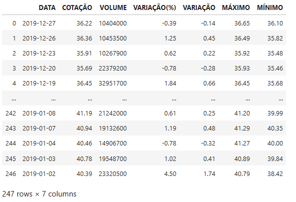

------------------------


```python
In [61]: bradescoData.dtypes
Out[61]: 
		DATA           datetime64[ns]
		COTAÇÃO               float64
		VOLUME                  int32
		VARIAÇÃO(%)           float64
		VARIAÇÃO              float64
		MÁXIMO                float64
		MÍNIMO                float64
		dtype: object
```

# Dashboard - Ações do Bradesco

```python
In [62]: import seaborn as sns
In [63]: import matplotlib.pyplot as plt
In [64]: %matplotlib inline
```


```python
In [65]: bradescoData.plot(x ='DATA', y = ['MÁXIMO', 'MÍNIMO'], figsize=(15, 3), 
							title='Ações - Bradesco', grid=True)
		 plt.ylabel('Variação')
		 plt.xlabel('Data')
		 plt.legend(loc='best')
Out[65]:
```

-------------------------
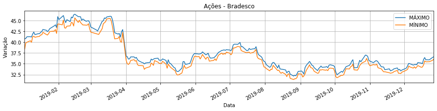

------------------------


```python
In [66]: columns = ['MÁXIMO','MÍNIMO', 'COTAÇÃO']
In [67]: bradescoData.plot(x ='DATA', y = columns, figsize=(15, 4), title='Ações - Bradesco', grid=True)
Out[67]:
```

-------------------------
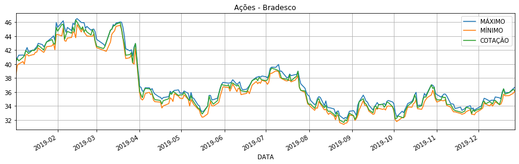

------------------------


```python
In [68]: columns = ['VARIAÇÃO', 'VARIAÇÃO(%)']
In [69]: bradescoData.plot(x ='DATA', y = columns, figsize=(15, 4), title='Ações - Bradesco', grid=True)
Out[69]:
```
-------------------------
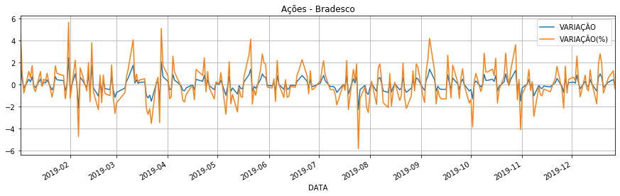

------------------------


```python
In [70]: fig, ax1 = plt.subplots(1, 1, figsize=(12, 6))
		 sns.distplot(bradescoData.COTAÇÃO.dropna(), bins=100, ax=ax1)
		 #fig.savefig('graph2.png')
Out[70]:
```

-------------------------
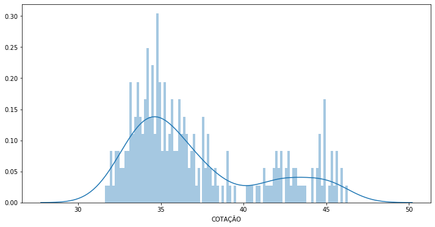

------------------------


**Exemplos Práticos**

```python
#Deletando um coluna
dataName.drop('ColumName', inplace=True, axis=1)


#Ver dados faltantes 
data.isnull()
data.isnull().sum()


#Preenchendo valores nulos com média
data.fillna(data.mean(0))


#Alterando o índice do dataFrame
data.set_index('Código', inplace=True)


#Acessar por rótulos
data.loc['001']
```


## Coluna Data para Séries Temporais 


```python
#Removendo o index antigo e colocando a coluna data como index.
In [71]: bradescoData.set_index('DATA', inplace=True)
In [72]: bradescoData
Out[72]:
```

-------------------------
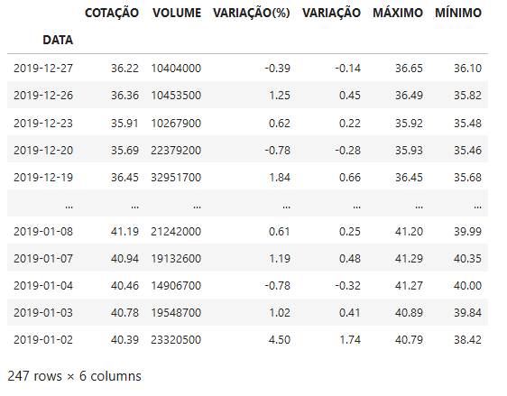

------------------------


## Gráficos com Séries Temporais 

```python
In [73]: fig, ax1 = plt.subplots(1, 1, figsize=(15, 4))
		 bradescoData['Month'] = bradescoData.index.to_period('m')
		 sns.boxplot('Month', 'COTAÇÃO', data=bradescoData, ax=ax1)
Out[73]:
```

-------------------------
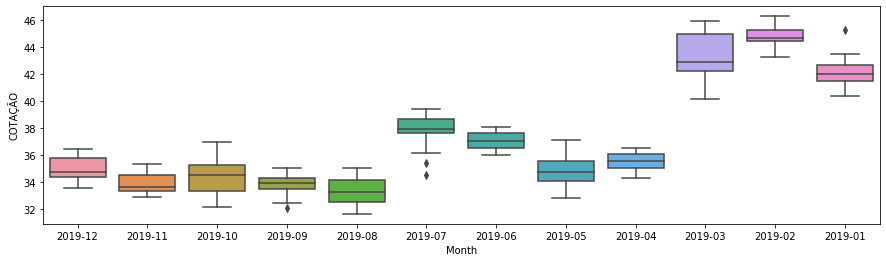

------------------------


```python
In [74]: fig, ax1 = plt.subplots(1, 1, figsize=(25, 8))
		 bradescoData['Day'] = bradescoData.index.to_period('d')
		 sns.boxplot('Day', 'COTAÇÃO', data=bradescoData, ax=ax1)
Out[74]:
```
-------------------------
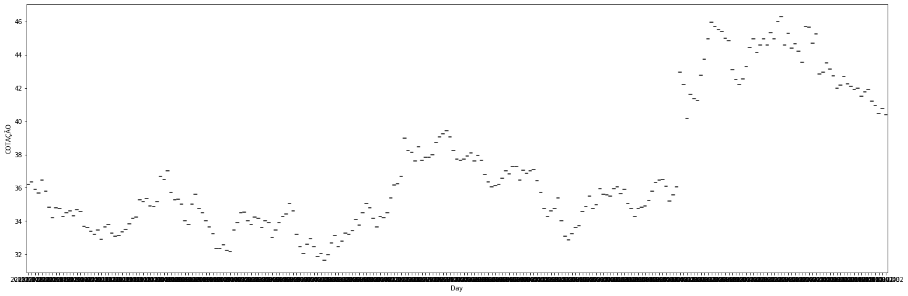

------------------------


** Manipulando a Coluna data **
```python
# year = bradescoData.index.to_period('Y')
# month = bradescoData.index.to_period('m')
# day = bradescoData.index.to_period('d')
# hour = bradescoData.index.to_period('h')
# minute = bradescoData.index.to_period('T')
# second = bradescoData.index.to_period('s')
#'T' represents minute based frequency
# 'H' represents hourly frequency 
# 'S' represents secondly frequency 
# M month
#YYYY-MM-DD[*HH[:MM[:SS[.fff[fff]]]][+HH:MM[:SS[.ffffff]]]]
```


```python
In [75]: lm = sns.lmplot('VARIAÇÃO', 'COTAÇÃO', data=bradescoData, aspect=2.5, order=3)
		 #lm.ax.xaxis.set_major_formatter(mdates.DateFormatter('%y-%m-%d'))
		 lm.ax.set_xlabel('Variação')
Out[75]:  
		Text(0.5, 6.79999999999999, 'Variação')
```

-------------------------
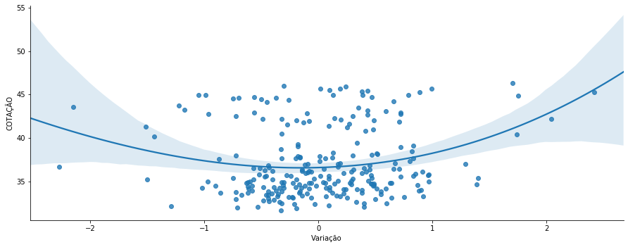

------------------------


```python
In [76]: corr = bradescoData.corr()
In [77]: corr
Out[77]: 
```

-------------------------
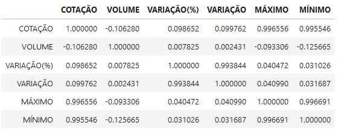

------------------------


```python
In [78]: def plot_corr(corr):
			# Cortaremos a metade de cima pois é o espelho da metade de baixo
			mask = np.zeros_like(corr, dtype=np.bool)
			mask[np.triu_indices_from(mask, 1)] = True    
			# Calculando a correlação
			sns.heatmap(corr, mask=mask, cmap='RdBu', square=True, linewidths=.5)

In [79]: plot_corr(corr)
Out[79]:
```

-------------------------


------------------------


** Algumas dicas **
```python
# Com Pandas - gráfico (pie)
# bradescoData.VARIAÇÃO.value_counts().plot(kind='pie', autopct='%.2f%%')
# plt.axis('equal')
```


```python
In [80]: sns.factorplot('VARIAÇÃO', data=bradescoData, kind='count')
Out[80]:
```

-------------------------
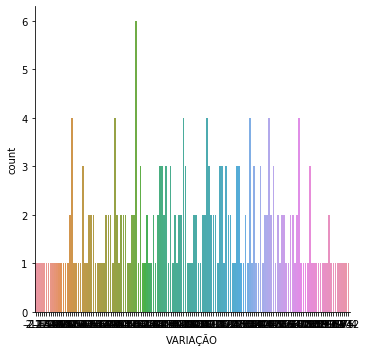

------------------------


```python
# Com Pandas
In [81]: df.COTAÇÃO.value_counts().plot(kind='pie', autopct='%.2f%%')
		 plt.axis('equal')
Out[81]:
```

-------------------------


------------------------


```python
# Com Seaborn
In [82]: sns.factorplot('COTAÇÃO', data=df, kind='count')
Out[82]:
```

-------------------------
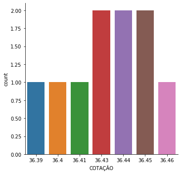

------------------------


# Referências:

- https://medium.com/@carlosbaia/visualiza%C3%A7%C3%A3o-e-an%C3%A1lise-de-dados-811780fd0e9f
- https://seaborn.pydata.org/
- https://matplotlib.org/
- https://www.vooo.pro/insights/biblioteca-seaborn-com-o-matplotlib/
- https://blog.4linux.com.br/web-scraping-python-selenium-e-beautifulsoup/
- https://towardsdatascience.com/web-scraping-using-selenium-and-beautifulsoup-99195cd70a58
- https://selenium-python.readthedocs.io/api.html
- https://pt.stackoverflow.com/questions/337093/problema-click-botao-python-selenium
- https://datatofish.com/plot-dataframe-pandas/
