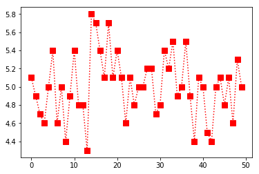
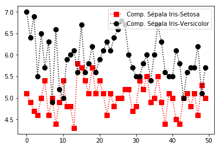

# PYTHON
<div class="panel panel-info">
AINDA EM CONSTRUÇÃO
</div>

Como toda boa análise de dados, é necessário uma boa ferramenta de manipulação destes dados. Nesta documentação falaremos o tempo todo em ferramentas de manipulação de dados. Logo, recomendo fortemente que você tenha instalado a distribuição anaconda, pois ela já vem munida da linguagem de programação python e sua principais bibliotecas, como pandas, numpy, matplotlib, seaborn etc. Caso contrário, você poderá instalar o python e as bibliotecas separadamente. Segue o link do Anaconda e do python. 

Observação: Recomendo que instale o pack anaconda, assim não precisará instalar mais nada.


<button onclick="window.open('https://www.anaconda.com/distribution');">ANACONDA</button>
<button onclick="window.open('https://www.python.org/downloads/');">PYTHON</button>

# COMANDOS ÚTEIS

Lista de comandos para análise de dados em python

<h3> Para entender o Jupyter </h3>

**Dois modos**

1. modo edição: escreve em uma célula
1. modo comando: movimenta as células

**Dois tipos de células**

1. código (esc, depois y)
1. markdown (esc, depois m)

**Modo comando (azul)**

- m - muda célula para markdown
- y - muda célula para python
- a - cria célula acima (above)
- b - cria célula abaixo (bellow)
- v - cola célula
- c - copia célula
- x - recorta/apaga célula
- f - pesquisar e substituir palavras
- l - mostra números das linhas
- h - lista de atalhos
- 00 (zero duas vezes) - reinicia o notebook
- SHIFT - M: mescla células
- CTRL + SHIFT + (sinal de menos): divide célula

**Modo edição (verde)**

- SHIFT-ENTER - executa os comandos que estão dentro da célula
- objeto.<TAB> - sugestões de métodos

**Alguns comandos**

- %matplotlib inline - para que os gráficos apareçam no documento (um resquício de versões antigas)
- import pandas as pd - carrega algum pacote (p. ex., pandas) como alguma sigla (p. ex., pd)
- x = [209, 32, 4, 23, 45] - cria um objeto chamado x contendo uma lista com os números 209, 32, 4, 23 e 45. Atenção: o python começa a contar em zero.
- x[0] - mostra o primeiro elemento da lista (209),
- x[1] mostra o segundo elemento (32) etc.
- x[1:4] - mostra os números nas posições 1, 2, 3 (32, 4 e 23)
- x[:2] - mostra todos os elementos até o terceiro (209 e 32), não incluindo o terceiro (intervalo aberto).
- x[3:] - mostra todos os elementos a partir do quarto (23 e 45), incluindo o quarto.
- x[:] - mostra todos os elementos da lista.
- len(x) - mostra o tamanho de x. Nesse caso, 3.
- sum([209, 32, 4, 23 e 45]) ou sum(x) - soma os valores.
- min(x) e max(x) - mostra os valores mínimos e máximos.

**Operadores matemáticos**

- 3 * 2 (multiplicação)
- 6 / 3 (divisão)
- 2 ** 3 (potenciação (p. ex, dois elevado a três))
- =  (atribuição (p. ex., x recebe 3))
- ==  (teste de igualdade (p. ex., ‘município == “Varginha”’ testa se o município é Varginha)).
- !=  (teste de desigualdade (p. ex., ‘município != “Varginha”’ testa se o município não é Varginha).
- &  ( operador lógico e)
- | (operador lógico ou)
-  <= >= (menor ou igual que, maior ou igual que)

**Ler dados e mostrar informações básicas**

*Os exemplos a seguir foram elaborados com uma base em dados do pnad (Pesquisa Nacional por Amostra de Domicílios - IBGE), isso explica a utilização do pnad na maioria dos comandos.*

- pnad = pd.read_csv('pnad022017.csv') - lê o arquivo csv e o transforma em um objeto dataframe chamado pnad
- pnad = pd.read_excel('pnad022017.xls') - lê o arquivo do Excel (xls ou xlsx) e o transforma em um objeto dataframe.
- pnad.shape - mostra o número de linhas e colunas do dataframe. Obs: nesse caso não é preciso abrir e fechar parêntesis.
- pnad.columns - mostra o nome das colunas (variáveis). Obs: nesse caso não é preciso abrir e fechar parêntesis.
- pnad.head(10) - mostra as primeiras dez linhas do dataframe, o padrão é mostrar 5.
- pnad.tail(10) - mostra as últimas dez linhas do dataframe.
- pnad.info() - mostra os tipos das variáveis e o tamanho do dataframe na memória.
- pnad.loc[ :, ['sexo', 'idade', 'renda']] - subseleção por rótulos (labels), mostra todas as linhas, apenas das variáveis indicadas.
- pnad.iloc[ :10, [3, 4, 5]] - subseleção por posição (i). No exemplo, mostra apenas as primeiras das variáveis nas posições indicadas.

*Atenção: note o uso de dois pares de colchetes em .loc e .iloc. O primeiro deles deriva do fato de que funções usam colchetes ao invés pois são subseleções, como no caso das listas explicado acima. O segundo par de colchete é usado quando queremos indicar mais de um elemento, situação em que é preciso criar uma lista.*

**Estatísticas básicas**

- pnad.describe() - mostra o resumo estatístico (mínimo, máximo, média, mediana e quartis) de todas as variáveis do dataframe.
- pnad.min() - mostra o valor mínimo de todas as variáveis. O mesmo pode ser feito com todos os comandos abaixo.
- pnad.renda.describe() - mostra o resumo estatístico da variável selecionada.
- pnad.renda.min() - mostra a observação com a menor renda.
- pnad.renda.max() - a maior renda.
- pnad.renda.mean() - a média da renda.
- pnad.renda.std() - o desvio padrão da renda.
- pnad.renda.var() - a variância da renda.
- pnad.renda.mad() - o desvio absoluto médio da renda.
- pnad.renda.sum() - o somatório da renda.
- pnad.renda.cumsum() - a soma acumulada da renda.
- pnad.cov( ) - a matriz de covariâncias
- pnad.corr( ) - a matriz de correlações.
- pnad.loc[ :, [‘renda’, ‘idade’, ‘estudo’]].corr() - a correlação entre a renda, a idade e anos de estudo.

**Operações com dataframes**

- pd.ocup_cod.unique() - mostra todos os valores não repetidos da variável ocup_cod (código da ocupação).
- pd.sexo.value_counts() - mostra quantas observações há em cada um valores da variável sexo.
- pnad.query(‘renda > 10000’) - seleciona apenas as observações com renda maior do que 10 mil.
- pnad.query(‘renda > 10000 & idade < 60 & sexo == 2’) - apenas observações com renda maior do que 10 mil, idade menor do que 60 e que sejam mulheres (o sexo feminino foi codificado como 2).
- pnad.groupby('sexo').idade.mean() - agrupa as observações por sexo e mostra a média de idade de cada um dos sexos.
- pnad.sort_values(by='renda', ascending=False) - ordena as observações por renda, em ordem decrescente.
- Ajuda - SHIFT-TAB quando o curso estiver em algum comando. Segure o SHIFT e vá apertando o TAB até quatro vezes para ir aumentando o tamanho da ajuda.
- pnad.head? - o mesmo que apertar SHIFT-TAB quatro vezes, mostra a documentação do comando .head().
- pnad.head?? - mostra o código usado pela função .head().

-------------------------------------------------------------------------------
# Numpy
(Introdução ao Numpy)

O NumPy é uma poderosa biblioteca da linguagem de programação Python, que permite trabalhar com eficiência vetores, matrizes, arranjos e permite diversas funções e operações matemáticas. Assim como no python, o Numpy possui um sintaxe clara e objetiva. Dentro da matemática, esta biblioteca permite trabalhar, de forma aplicada, com arranjos multidimensionais, matrizes de n dimensões, álgebra linear, geração de números aleatórios etc.

Para mais informações sobre o Numpy clique <a href="https://www.numpy.org/" target="_blank">aqui</a>.

<h3>Instalação - NumPy</h3>

Essa biblioteca não é nativa do Python, logo você precisará instalar. Se você baixou o pacote Anaconda, como recomendado, o numpy  já estará incluso. Caso contrário, você deverá utilizar a ferramenta pip do seu python. Digite o seguinte comando no seu terminal linux ou prompt windowns.

```python
pip install numpy
```
---
<h2> Ttutorial </h2>

<h3>Importando a biblioteca</h3>

Utilizando o editor de sua preferência como o vsCode, atom ou Pycharme, importe a biblioteca.

```python
import numpy as np
```
---

<h3>Criando uma Array(Matriz)</h3>
No código abaixo podemos observar um exemplo de uma list, pois o python não oferece suporte para arrays, porém o Numpy permite que tratemos uma list como um array, como será observado no exemplo 2. 


**Exemplo 1: List**

```python
In [1]: lista = [10,20,40,30]
In [2]: type (lista)

Out[2]: list
```

**Exemplo 2: Numpay Array**

```python
In [1]: Matriz = [10,20,40,30]
In [2]: type (Matriz)

Out[2]: numpy.ndarray
```

<h2> Manipulando Arrays </h2>

**Criando uma matriz**

```python

In [1]: m2 = np.array ([[1, 2], [3, 4]])
In [2]: m2

Out[2]: array([[1, 2],
               [3, 4]])

```

**Selecionando elementos de uma matriz**

```python

In [3]: print(m2[0])
Out[3]: [1 2]

In [4]: print(m2[1])
Out[4]: [3 4]

In [5]: print(m2[1][0])
Out[5]: 3

```

**Matriz transposta**

```python

In [3]: print(m2.transpose())
Out[5]: [[1 3]
         [2 4]]

```

**Criando novas matrizes**

```python

In [6]: m3 = np.array([[5,6], [7,8]])
In [7]: m4 = np.array([[1,2], [3,4]])

```
**Somando matrizes**
OBS: a soma, a subtração e a multiplicação funcionam como na geometria. Para manipulações de dados de modo convencional do python, utilizar uma list.

```python
In [8] print(m3 + m4)
Out[8] [[ 6  8]
        [10 12]]
```

**Somando todos os elementos**
OBS: foram somados os elementos da matriz m3, criada logo acima. 

```python
In [9] print (m3.sum())
Out[9] 26
```

**Média Aritmética**


```python
In [10]: print (m4.mean())
Out[10]: 2.5
```

<h2> Fatiamento de Array </h2>

**Criando nova matriz**

```python
In [11]: m4 = np.array([[1,2,5,10], [3,4,6,8],[5,7,6,8],[3,2,0,4]])

In [12]: m4
Out[12]:  [[ 1,  2,  5, 10],
           [ 3,  4,  6,  8],
           [ 5,  7,  6,  8],
           [ 3,  2,  0,  4]]
```

**Fatiando a Matriz**

```python
In [13]: print(m4[1:3])

Out[13]:  [[3, 4, 6, 8],
           [5, 7, 6, 8]]
```

```python
In [14]: print(m4[::2])

Out[14]:  [[ 1,  2,  5, 10],
           [ 5,  7,  6,  8]]
```
```python
In [15]: np.array_split(x8,2,axis=0)

Out[15]:  [array([[ 1,  2,  5, 10]]), array([[5, 7, 6, 8]])]
```

<h2> Manipulando termos da Array </h2>

**Criando nova matriz**

```python

In [16]: m5 = np.array([[12,2,27,12],[31,4,5,25]])

In [17]: print(m5)
Out[17]:  [[12,  2, 27, 12],
           [31,  4,  5, 25]]
```

**Trocando um termo da matriz**

```python
In [18]: m5[0,0] = 100

In [19]: print(m5)
Out[19]:  [[100,   2,  27,  12]
           [ 31,   4,   5,  25]]
```
**Criando duas matrizes**

```python

In [20]: m6 = np.array([1,2,3])
In [21]: m61 = np.array([4,5,8])

```
**anexar apenas um termo**

```python
In [22]: Result = np.insert(m6, 1, 10)

In [23]: print(Result)
Out[23]:  [ 1 10  2  3]

```

**anexar vários termos**

```python
In [22]: varios = np.append(m6, [10,15,16])

In [23]: print(varios)
Out[23]:  [ 1,  2,  3, 10, 15, 16]

```

**concatenar dois arrays**

```python
In [24]: Result2 = np.concatenate((m6, m61), axis=0)

In [25]: print(Result2)
Out[25]:  [1 2 3 4 5 8]

```
**anexar em dimensões de eixo 0**


```python
In [26]: m7 = np.array([[1,2,3],[5,8,7]])

In [27]: np.append(m7, [[8,8,8]], axis=0)
Out[27]: array([[1, 2, 3],
                [5, 8, 7],
                [8, 8, 8]])

```

**anexar em dimensões de eixo 1**

```python
In [28]: m8 = np.array([[1,2,3],[5,9,7]])

In [29]: np.append(m8, [[8],[8]], axis=1)
Out[29]: array([[1, 2, 3, 8],
                [5, 9, 7, 8]])

```
**deletar termo de uma matriz**

```python
In [30]: m9 = np.array([[1,2],[3,4],[5,6]])
```

```python
#deletando em axis 0
In [31]: np.delete(m9, 1, 0)
Out[31]: array([[1, 2],
                [5, 6]])

```


```python
#deletando em fatiamento(com razão 2)
In [32]: m10 = np.array([[1,2,3],[3,4,7],[5,6,4]0,[4,5,9]])
In [33]: np.delete(m10,np.s_[::2],0)
Out[32]: array([[1, 2],
                [5, 6]])

```
------------------------------------------------------------------------------


# MATPLOTLIB

Segundo a documentação oficial, o Matplotlib é uma biblioteca de plotagem 2D do Python que produz inúmeros gráficos de qualidade em uma variedade de formatos e ambientes interativos. O Matplotlib pode ser usado em scripts Python, nos shells do Python e do IPython, no notebook Jupyter, nos servidores de aplicativos da web e em kits de ferramentas de interface gráfica do usuário. Para mais informações sobre esta biblioteca, clicar <a href="https://matplotlib.org/" target="_blank">aqui</a>.

Neste tutorial, o matplotlib será utilizado com o auxíio do numpy e do data-set iris, que pode ser encontrado <a href="https://archive.ics.uci.edu/ml/machine-learning-databases/iris/" target="_blank">aqui</a>. OBS: cliclar na opção iris.data

**Instalação - Matplotlib**

Essa biblioteca não é nativa do Python, logo você precisará instalar. Se você baixou o pacote Anaconda, como recomendado nesta documentação, o matplotlib  já estará incluso Caso contrário, você deverá utilizar a ferramenta pip do seu python. Digite o seguinte comando no seu terminal linux ou prompt windowns.

```python
pip install matplotlib
```
---
<h3> Tutorial </h3>

**Importando as bibliotecas**
Utilizando o editor de sua preferência como o vsCode, atom ou Pycharm, importe as bibliotecas.

```python
import numpy as np
import matplotlib.pyplot as plt
%matplotlib inline
```

O uso do matplotlib inline é recomendado para quem estiver utilizando o jupyter, para que o gráfico seja plotado em sua linha de comando. Quem estiver utilizando o shell, terminal ou ipython, recomenda-se colocar o plt.show() no final de cada chamada de gráfico. 


**Lendo o data set**

Atenção: o caminho ../_DATASET corresponde ao local em que está salvo o meu arquivo iris.data.


```python
In [1]: data = np.genfromtxt('../_DATASET/iris.data', delimiter=',', usecols=(0,1,2,3))

In [2]: data

Out[2]: array ([[5.1, 3.5, 1.4, 0.2],
                [4.9, 3. , 1.4, 0.2],
                [4.7, 3.2, 1.3, 0.2],
                [4.6, 3.1, 1.5, 0.2],
                [5. , 3.6, 1.4, 0.2],
                [5.4, 3.9, 1.7, 0.4],
                [4.6, 3.4, 1.4, 0.3],
                [5. , 3.4, 1.5, 0.2],
                [4.4, 2.9, 1.4, 0.2],
                [4.9, 3.1, 1.5, 0.1],
                [5.4, 3.7, 1.5, 0.2],
                [4.8, 3.4, 1.6, 0.2],
                [4.8, 3. , 1.4, 0.1],
                [4.3, 3. , 1.1, 0.1],
                [5.8, 4. , 1.2, 0.2],
                [5.7, 4.4, 1.5, 0.4],
                [5.4, 3.9, 1.3, 0.4],
                [5.1, 3.5, 1.4, 0.3],
                [5.7, 3.8, 1.7, 0.3],
                [5.1, 3.8, 1.5, 0.3],
                [5.4, 3.4, 1.7, 0.2],
                [5.1, 3.7, 1.5, 0.4],
                [4.6, 3.6, 1. , 0.2],
                [5.1, 3.3, 1.7, 0.5],
                [4.8, 3.4, 1.9, 0.2],
                [5. , 3. , 1.6, 0.2],
                [5. , 3.4, 1.6, 0.4],
                [5.2, 3.5, 1.5, 0.2],
                [5.2, 3.4, 1.4, 0.2],
                [4.7, 3.2, 1.6, 0.2],
                [4.8, 3.1, 1.6, 0.2],
                [5.4, 3.4, 1.5, 0.4],
                [5.2, 4.1, 1.5, 0.1],
                [5.5, 4.2, 1.4, 0.2],
                [4.9, 3.1, 1.5, 0.1],
                [5. , 3.2, 1.2, 0.2],
                [5.5, 3.5, 1.3, 0.2],
                [4.9, 3.1, 1.5, 0.1],
                [4.4, 3. , 1.3, 0.2],
                [5.1, 3.4, 1.5, 0.2],
                [5. , 3.5, 1.3, 0.3],
                [4.5, 2.3, 1.3, 0.3],
                [4.4, 3.2, 1.3, 0.2],
                [5. , 3.5, 1.6, 0.6],
                [5.1, 3.8, 1.9, 0.4],
                [4.8, 3. , 1.4, 0.3],
                [5.1, 3.8, 1.6, 0.2],
                [4.6, 3.2, 1.4, 0.2],
                [5.3, 3.7, 1.5, 0.2],
                [5. , 3.3, 1.4, 0.2],
                [7. , 3.2, 4.7, 1.4],
                [6.4, 3.2, 4.5, 1.5],
                [6.9, 3.1, 4.9, 1.5],
                [5.5, 2.3, 4. , 1.3],
                [6.5, 2.8, 4.6, 1.5],
                [5.7, 2.8, 4.5, 1.3],
                [6.3, 3.3, 4.7, 1.6],
                [4.9, 2.4, 3.3, 1. ],
                [6.6, 2.9, 4.6, 1.3],
                [5.2, 2.7, 3.9, 1.4],
                [5. , 2. , 3.5, 1. ],
                [5.9, 3. , 4.2, 1.5],
                [6. , 2.2, 4. , 1. ],
                [6.1, 2.9, 4.7, 1.4],
                [5.6, 2.9, 3.6, 1.3],
                [6.7, 3.1, 4.4, 1.4],
                [5.6, 3. , 4.5, 1.5],
                [5.8, 2.7, 4.1, 1. ],
                [6.2, 2.2, 4.5, 1.5],
                [5.6, 2.5, 3.9, 1.1],
                [5.9, 3.2, 4.8, 1.8],
                [6.1, 2.8, 4. , 1.3],
                [6.3, 2.5, 4.9, 1.5],
                [6.1, 2.8, 4.7, 1.2],
                [6.4, 2.9, 4.3, 1.3],
                [6.6, 3. , 4.4, 1.4],
                [6.8, 2.8, 4.8, 1.4],
                [6.7, 3. , 5. , 1.7],
                [6. , 2.9, 4.5, 1.5],
                [5.7, 2.6, 3.5, 1. ],
                [5.5, 2.4, 3.8, 1.1],
                [5.5, 2.4, 3.7, 1. ],
                [5.8, 2.7, 3.9, 1.2],
                [6. , 2.7, 5.1, 1.6],
                [5.4, 3. , 4.5, 1.5],
                [6. , 3.4, 4.5, 1.6],
                [6.7, 3.1, 4.7, 1.5],
                [6.3, 2.3, 4.4, 1.3],
                [5.6, 3. , 4.1, 1.3],
                [5.5, 2.5, 4. , 1.3],
                [5.5, 2.6, 4.4, 1.2],
                [6.1, 3. , 4.6, 1.4],
                [5.8, 2.6, 4. , 1.2],
                [5. , 2.3, 3.3, 1. ],
                [5.6, 2.7, 4.2, 1.3],
                [5.7, 3. , 4.2, 1.2],
                [5.7, 2.9, 4.2, 1.3],
                [6.2, 2.9, 4.3, 1.3],
                [5.1, 2.5, 3. , 1.1],
                [5.7, 2.8, 4.1, 1.3],
                [6.3, 3.3, 6. , 2.5],
                [5.8, 2.7, 5.1, 1.9],
                [7.1, 3. , 5.9, 2.1],
                [6.3, 2.9, 5.6, 1.8],
                [6.5, 3. , 5.8, 2.2],
                [7.6, 3. , 6.6, 2.1],
                [4.9, 2.5, 4.5, 1.7],
                [7.3, 2.9, 6.3, 1.8],
                [6.7, 2.5, 5.8, 1.8],
                [7.2, 3.6, 6.1, 2.5],
                [6.5, 3.2, 5.1, 2. ],
                [6.4, 2.7, 5.3, 1.9],
                [6.8, 3. , 5.5, 2.1],
                [5.7, 2.5, 5. , 2. ],
                [5.8, 2.8, 5.1, 2.4],
                [6.4, 3.2, 5.3, 2.3],
                [6.5, 3. , 5.5, 1.8],
                [7.7, 3.8, 6.7, 2.2],
                [7.7, 2.6, 6.9, 2.3],
                [6. , 2.2, 5. , 1.5],
                [6.9, 3.2, 5.7, 2.3],
                [5.6, 2.8, 4.9, 2. ],
                [7.7, 2.8, 6.7, 2. ],
                [6.3, 2.7, 4.9, 1.8],
                [6.7, 3.3, 5.7, 2.1],
                [7.2, 3.2, 6. , 1.8],
                [6.2, 2.8, 4.8, 1.8],
                [6.1, 3. , 4.9, 1.8],
                [6.4, 2.8, 5.6, 2.1],
                [7.2, 3. , 5.8, 1.6],
                [7.4, 2.8, 6.1, 1.9],
                [7.9, 3.8, 6.4, 2. ],
                [6.4, 2.8, 5.6, 2.2],
                [6.3, 2.8, 5.1, 1.5],
                [6.1, 2.6, 5.6, 1.4],
                [7.7, 3. , 6.1, 2.3],
                [6.3, 3.4, 5.6, 2.4],
                [6.4, 3.1, 5.5, 1.8],
                [6. , 3. , 4.8, 1.8],
                [6.9, 3.1, 5.4, 2.1],
                [6.7, 3.1, 5.6, 2.4],
                [6.9, 3.1, 5.1, 2.3],
                [5.8, 2.7, 5.1, 1.9],
                [6.8, 3.2, 5.9, 2.3],
                [6.7, 3.3, 5.7, 2.5],
                [6.7, 3. , 5.2, 2.3],
                [6.3, 2.5, 5. , 1.9],
                [6.5, 3. , 5.2, 2. ],
                [6.2, 3.4, 5.4, 2.3],
                [5.9, 3. , 5.1, 1.8]])
```
**Selecionar somente a coluna, ou seja, selecionar somente o comprimento das sepolas**

```python
In [3]: data[:,0]

Out[3]: array([5.1, 4.9, 4.7, 4.6, 5. , 5.4, 4.6, 5. , 4.4, 4.9, 5.4, 4.8, 4.8,
       4.3, 5.8, 5.7, 5.4, 5.1, 5.7, 5.1, 5.4, 5.1, 4.6, 5.1, 4.8, 5. ,
       5. , 5.2, 5.2, 4.7, 4.8, 5.4, 5.2, 5.5, 4.9, 5. , 5.5, 4.9, 4.4,
       5.1, 5. , 4.5, 4.4, 5. , 5.1, 4.8, 5.1, 4.6, 5.3, 5. , 7. , 6.4,
       6.9, 5.5, 6.5, 5.7, 6.3, 4.9, 6.6, 5.2, 5. , 5.9, 6. , 6.1, 5.6,
       6.7, 5.6, 5.8, 6.2, 5.6, 5.9, 6.1, 6.3, 6.1, 6.4, 6.6, 6.8, 6.7,
       6. , 5.7, 5.5, 5.5, 5.8, 6. , 5.4, 6. , 6.7, 6.3, 5.6, 5.5, 5.5,
       6.1, 5.8, 5. , 5.6, 5.7, 5.7, 6.2, 5.1, 5.7, 6.3, 5.8, 7.1, 6.3,
       6.5, 7.6, 4.9, 7.3, 6.7, 7.2, 6.5, 6.4, 6.8, 5.7, 5.8, 6.4, 6.5,
       7.7, 7.7, 6. , 6.9, 5.6, 7.7, 6.3, 6.7, 7.2, 6.2, 6.1, 6.4, 7.2,
       7.4, 7.9, 6.4, 6.3, 6.1, 7.7, 6.3, 6.4, 6. , 6.9, 6.7, 6.9, 5.8,
       6.8, 6.7, 6.7, 6.3, 6.5, 6.2, 5.9])
```

**Selecionar a primeira coluna, somente os 50 primeiros dados, ou seja, Iris Setosa**

```python
In [4]: data[:50,0]

Out[4]: array([5.1, 4.9, 4.7, 4.6, 5. , 5.4, 4.6, 5. , 4.4, 4.9, 5.4, 4.8, 4.8,
       4.3, 5.8, 5.7, 5.4, 5.1, 5.7, 5.1, 5.4, 5.1, 4.6, 5.1, 4.8, 5. ,
       5. , 5.2, 5.2, 4.7, 4.8, 5.4, 5.2, 5.5, 4.9, 5. , 5.5, 4.9, 4.4,
       5.1, 5. , 4.5, 4.4, 5. , 5.1, 4.8, 5.1, 4.6, 5.3, 5. ])

```
<h3> Plotando Gráficos </h3>

**Plotando o gráfico das 50 primeiras iris(iris setosa)(coluna 1)**

```python
In [5]: plt.plot(data[:50,0], c='Red', ls=':', marker='s', ms=8)

Out[5]: [<matplotlib.lines.Line2D at 0x7f2844d13940>]

```
Gráfico plotado.



 OBS: Caso não esteja usando o jupyter, você deverá colocar plt.show(), como no exemplo abaixo:

```python
In [6]: plt.plot(data[:50,0], c='Red', ls=':', marker='s', ms=8)
In [7]: plt.show()
```

**Selecionar a primeira coluna, somente dos 50 a 100, ou seja, Iris Versicolor**

```python
In [8]: data[50:100,0]

Out[8]: array([7. , 6.4, 6.9, 5.5, 6.5, 5.7, 6.3, 4.9, 6.6, 5.2, 5. , 5.9, 6. ,
       6.1, 5.6, 6.7, 5.6, 5.8, 6.2, 5.6, 5.9, 6.1, 6.3, 6.1, 6.4, 6.6,
       6.8, 6.7, 6. , 5.7, 5.5, 5.5, 5.8, 6. , 5.4, 6. , 6.7, 6.3, 5.6,
       5.5, 5.5, 6.1, 5.8, 5. , 5.6, 5.7, 5.7, 6.2, 5.1, 5.7])

```
**Plotando um gráfico comparativo das petolas da: Iris Setosa e Iris Versicolor**

```python
In [8]: plt.plot(data[:50,0], c='Red', ls=':', marker='s', ms=8, label='Comp. Sépala Iris-Setosa')
        plt.plot(data[50:100,0], c='Black', ls=':', marker='o', ms=8, label='Comp. Sépala Iris-Versicolor')
        plt.legend()
        plt.show()
```
Gráfico plotado.


