# DMPS - TUTORIAL 01

Elaborado por:
 
Jonathan Cardoso Lopes Domingos
 
02/01/2020

Neste exemplo iremos importar um CSV via http. O csv pertence ao site do <button onclick="window.open('http://dados.turismo.gov.br/');">Ministério do Turismo</button>. Este csv contém, dentre outras, as informações
sobre emendas parlamentares destinadas a alguns municípios brasileiros. 

## Importando CSV via http.

Obs: para esta série de atividades, estarei utilizando o DMPS em uma máquina virtual na AWS.

> Tela inicial do login do DMPS

-------------------------

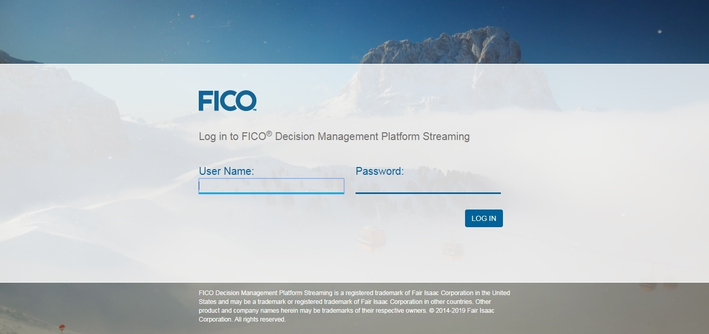

------------------------

> Plataforma de Trabalho do DMPS

-------------------------

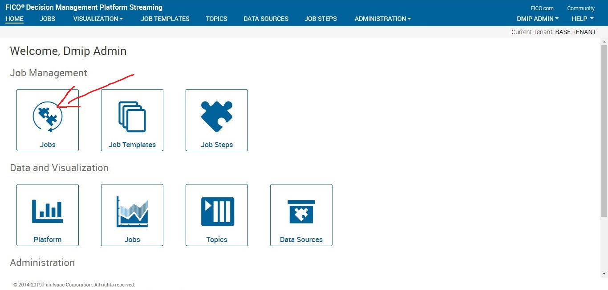

------------------------

> Iniciando um novo Job

-------------------------

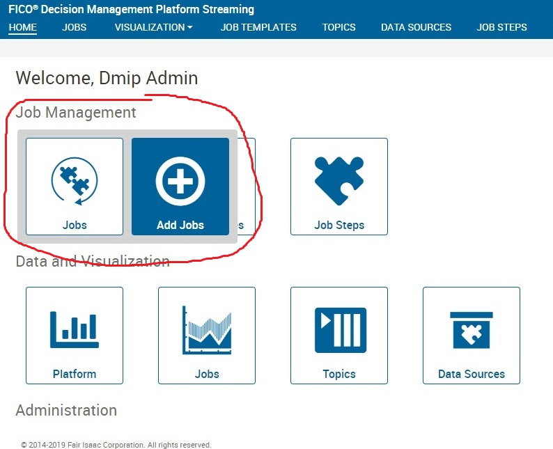

------------------------

> Adicionar nome e descrição

-------------------------

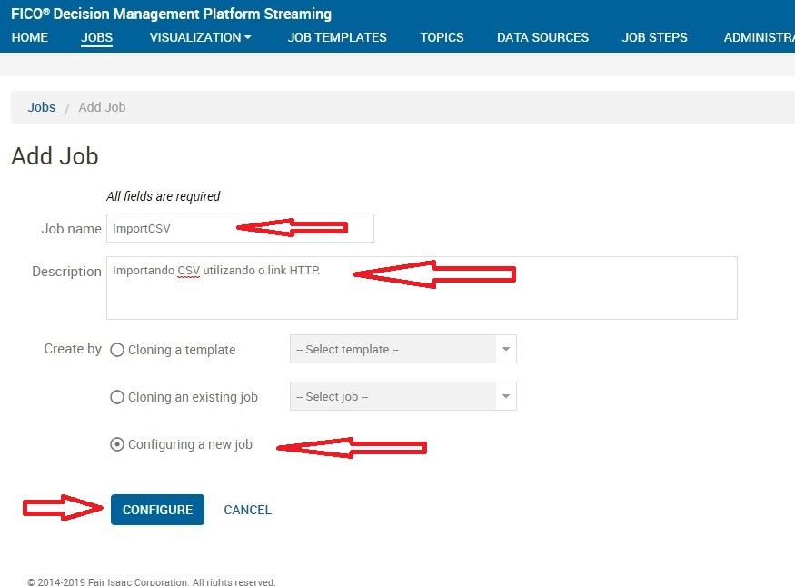

------------------------

> No lado esquerdo temos os job steps, que são estapas do nosso fluxo de decisão. 

-------------------------

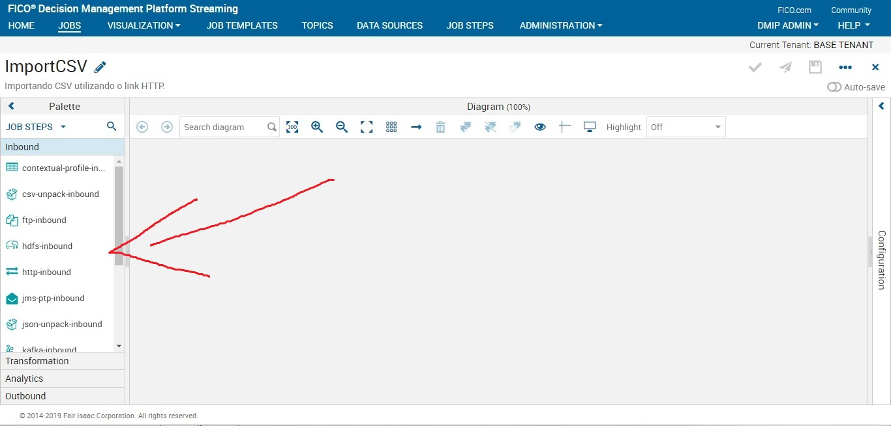

------------------------

## Job Step: http-inbound

> Para importar um CSV de um link HTTP usaremos o job step **http-inbound**. Basta segurar e arrastar o job para o centro da mesa de trabalho. 

-------------------------

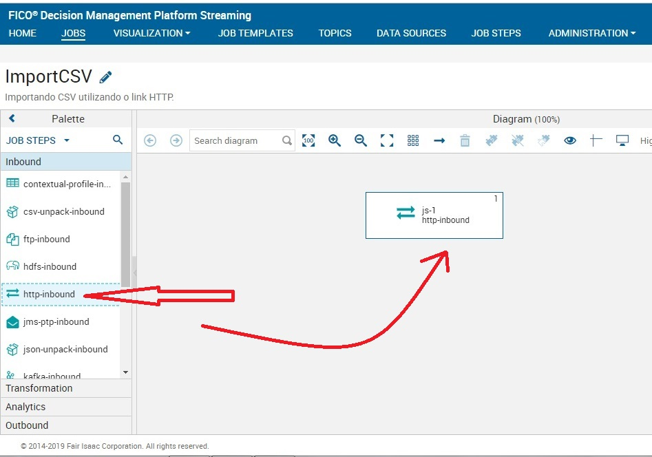

------------------------

> Dando um duplo clique sobre o job step, você pode começar a configurá-lo. Siga o passo das imagens abaixo. 

-------------------------

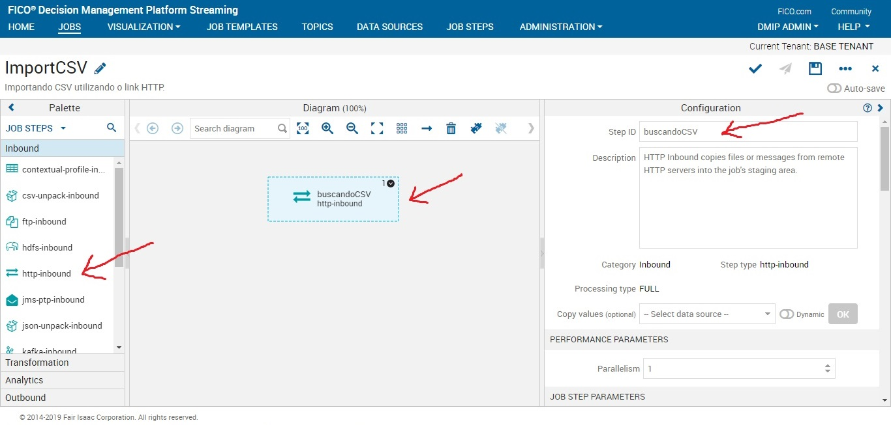

------------------------

Obs: O DMPS obriga você a escolher uma autenticação, mesmo que o link seja livre. 
No nosso caso usaremos um link livre. Logo em Username e Password você poderá colocar qualquer caractere. 
Eu optei por colocar admin no Username e admin no Password. 

Link para o arquivo csv:  

> http://dados.turismo.gov.br/images/csv/emendas/2017-emendas.csv

-------------------------

------------------------

-------------------------

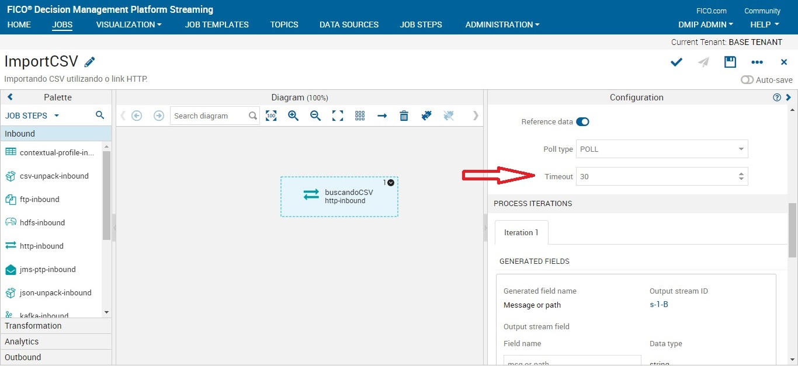

------------------------

> Antes de colocar nosso próximo job step, observe o nosso dataset:

-------------------------

------------------------

> Nossa tabela apresenta algumas inconsistências nos dados que, à medida que avançamos com
os tutoriais, iremos corrigindo. 

## Job Step: csv-unpack

> Este job faz um "reconhecimento" de uma linha do nosso dataset. Assim podemos trabalhar com índices. 

-------------------------

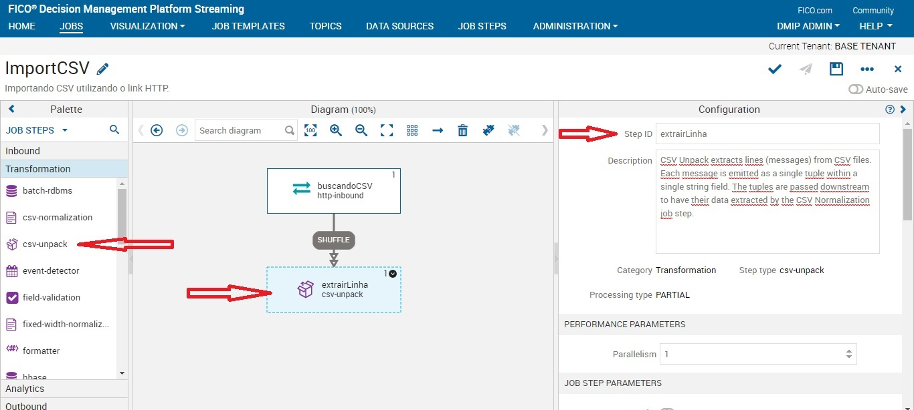

------------------------

-------------------------

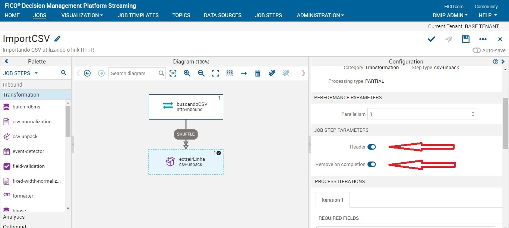

------------------------

-------------------------

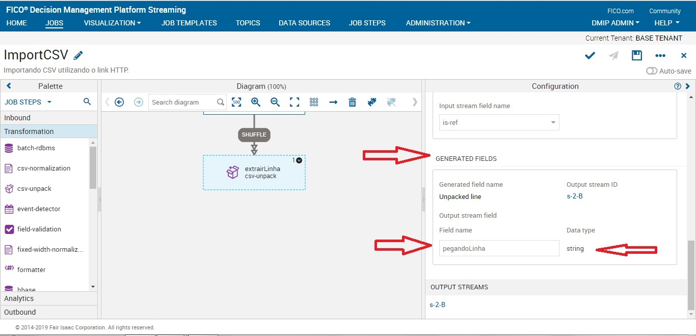

------------------------

## Job Step: csv-normalization

> Este job nos mostra quais coluna(dados) iremos utilizar em nosso fluxo. 

-------------------------

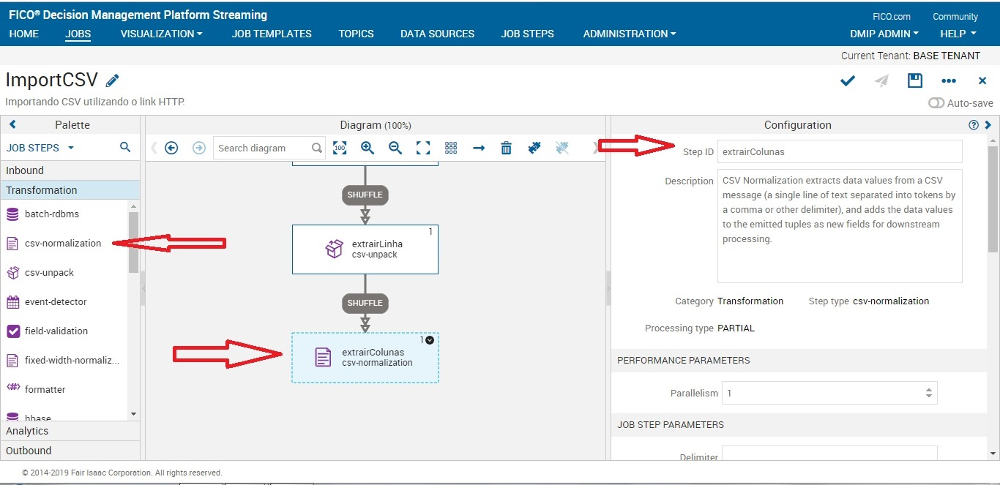

------------------------

Obs: sempre ver qual é o delimitador do seu CSV.

-------------------------

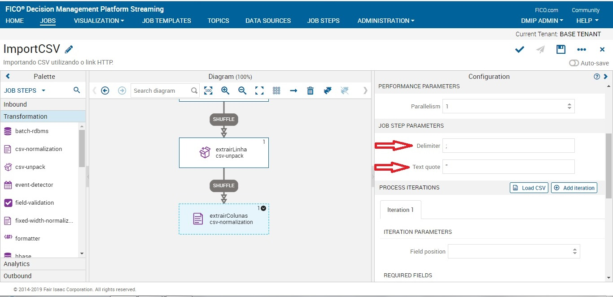

------------------------

> Pegando os dados da coluna 0 (Nº Convênio) do nosso dataset e atribuindo o nome de numeroConvenio.
Neste caso, estamos dizendo para o nosso fluxo utilizar a coluna zero do nosso dataset, porém ela receberá dentro do DMPS o nome de numeroConvenio.

-------------------------

------------------------

-------------------------

------------------------

> Como vamos trabalhar com mais dados do nosso csv, iremos adicionar quantas iterações forem necessárias. Cada iteração corresponde a uma coluna que iremos trabalhar. 
Para este job, iremos utilizar as seguintes colunas com os seguintes nomes:

iterations:

- 0 = numeroConvenio
- 1 = modalidade
- 2 = uf 
- 3 = local
- 4 = valorGlobal

-------------------------

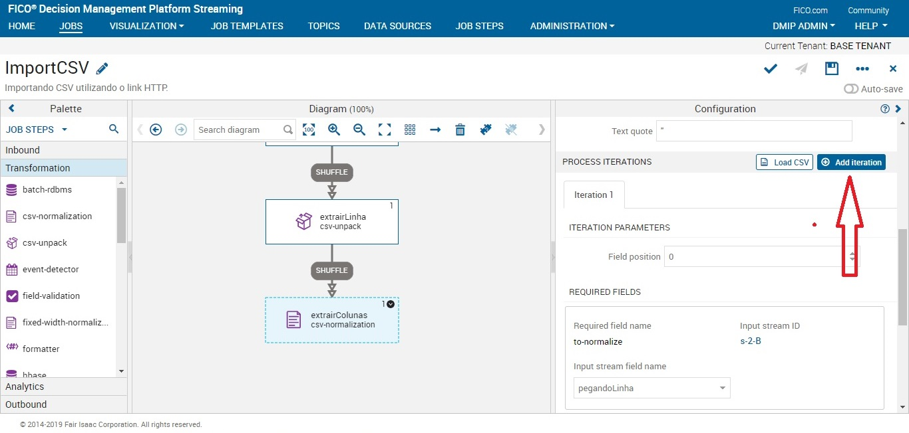

------------------------

-------------------------

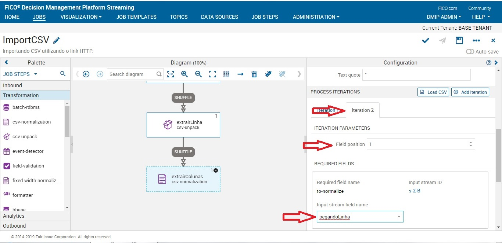

------------------------

> Lembre-se de salvar seu progresso com frequência:

-------------------------

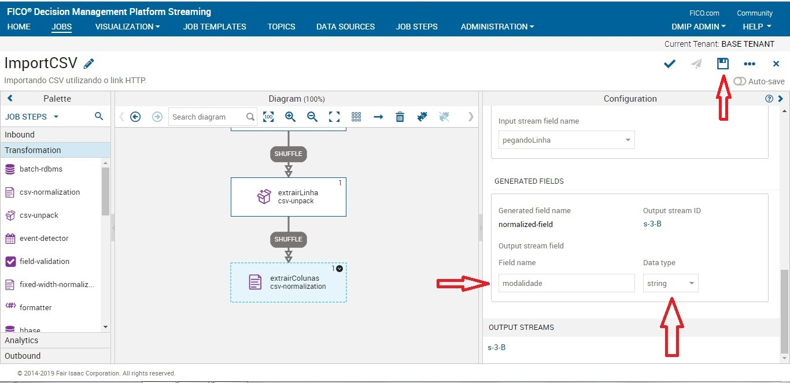

------------------------

-------------------------

------------------------

-------------------------

------------------------

-------------------------

------------------------

-------------------------

------------------------

> Observe que no exemplo a seguir, o valorGlobal receberá o tipo de string. 
Isso acontece por que a notação da coluna Valor Global está com um ponto 
como separador do número (295.500). Neste caso, teremos que tratar este dado (o que faremos mais
adiante) para que ele se torne um número inteiro. 
Se você tentar converter sem tratar, o DMPS irá mantê-lo como string. Ele não 
irá transformar o arquivo em Float pois tem dados que possuem dois pontos (1.239.346).

-------------------------

------------------------

-------------------------

------------------------

## Job Step: Script 

> Neste job step iremos tratar o problema com os dados valorGlobal. Iremos retirar o ponto e transformar 
o tipo de string para integer. 

-------------------------

------------------------

> Você pode escolher entre Python e JavaScript. Eu recomendo utilizar o Python, 
reza a lenda que ele é infinitas vezes melhor que JS. 

-------------------------

------------------------

> Selecione a variável que iremos tratar.

-------------------------

------------------------

> Nomeie uma nova variável de saída. 
Neste caso, a variável valorGlobal do tipo 
string irá sair como novoValorGlobal do tipo
integer. 

-------------------------

------------------------

> Criando um código python para retirar as inconsistências dos dados. 

-------------------------

------------------------

> Lembre-se: SALVAR

-------------------------

------------------------

## Job Step: Visualization-Store

> Agora iremos colocar um job step que permite visualizar os
resultados do nosso processo de streaming de dados. 

-------------------------

------------------------

-------------------------

------------------------

## Job Step: Visualization-Store (Erro)

> Iremos adicionar outro visualization-store para as saídas de erros. 
Todo job que possui códigos está sujeito a uma série de erros, logo
a visualization de erro nos permite ter um log de erros. 

-------------------------

------------------------

-------------------------

------------------------

> Antes de testar nosso job, iremos fazer um filtro das variáveis que
queremos que siga o nosso fluxo. 

> Dê um duplo clique no fluxo (SHUFFLE) que está entre tratamentoDados e resultados
e desmarque as seguintes opções.  

-------------------------

------------------------

## Testando o Fluxo:

> Após todo o processo de construção do fluxo, faremos um teste: 
clicar em salvar, verificar o código e por fim clicar em enviar. 

-------------------------

------------------------

> Após enviar, você poderá verificar que o seu job estará em situação de 
configurado. Agora basta rodar o job e esperar que esteja tudo pronto. 

-------------------------

------------------------

> Algumas informações podem indicar que seu job está funcionando. Observe as imagens a seguir:

-------------------------

------------------------

-------------------------

------------------------

## Visualizando Resultados

> Vá na aba visualization e clique em jobs

-------------------------

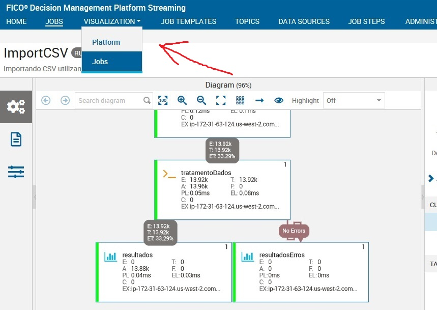

------------------------

-------------------------

------------------------

> Selecione o nome do seu Job

-------------------------

------------------------

> Os resultados das suas variáveis irão aparecer.

-------------------------

------------------------

> Podemos observar que o novoValorGlobal foi alterado para inteiro. Podemos observar, também, que um valor não está correto.
A variável local está recebendo o valor da coluna Valor Global do nosso csv. 

-------------------------

------------------------

## Corrigindo o ERRO

> Para corrigir o erro devemos voltar ao job step que pega as colunas do csv. 
Mas para isso devemos parar o nosso job. 

-------------------------

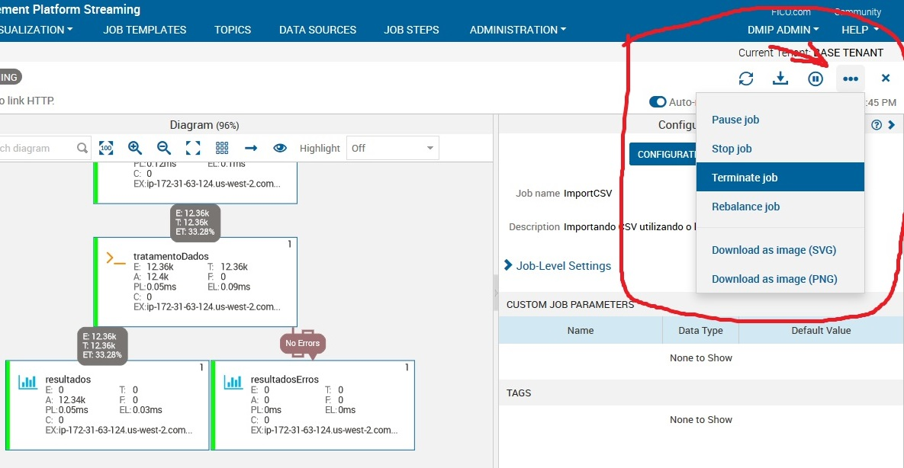

------------------------

> Ir em configure job

-------------------------

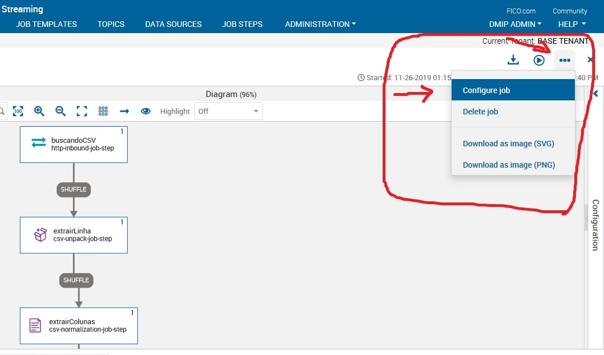

------------------------

> Dar um duplo clique no job extrairColunas e procurar a iteration que está com problema. 
Neste caso, é a iteration 4. Você deverá mudar o field position para 3. 

-------------------------

------------------------

-------------------------

------------------------

> Por que isso ocorre?

Observe a imagem a seguir:

-------------------------

------------------------

A nossa iteration 4 é a variavél local e no nosso csv a variável 
local está com 3. Isso ocorre por que no csv a primeira coluna é 
a coluna 0 e as iterações começam do 1. 
Após a alteração, devemos salvar o que foi feito. Para que as alterações sejam de 
fato visualizadas no nosso visualization job, devemos deletar o cash. 
Ir na aba visualization e clicar em jobs. Ir na opção **stores**

-------------------------

------------------------

> Em stores clique em atualizar, digite o nome do seu job, clique nos três pontinhos e, por fim, clique em deletar. 

-------------------------

------------------------

> Após deletar o cash do seu job, vá na aba JOBS, clique em All, 
digite o nome do seu job e clique sobre ele. 

-------------------------

------------------------

-------------------------

------------------------

> Agora basta ir em rodar. 

-------------------------

------------------------

> Se tudo deu certo, seu job apresentará os comportamentos normais, como já visualizado anteriormente. 

-------------------------

------------------------

> Agora basta ir em visualization - jobs - discover e selecionar o seu job.
Podemos observar que a variável local está corrigida. Agora ela apresenta
o nome do município.  
