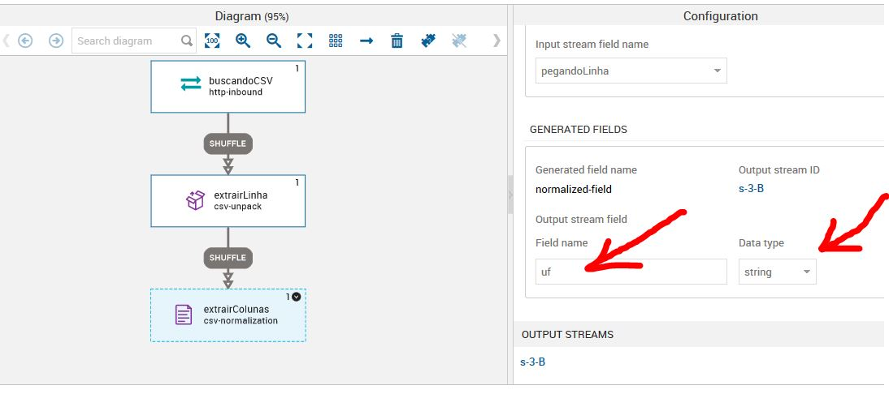
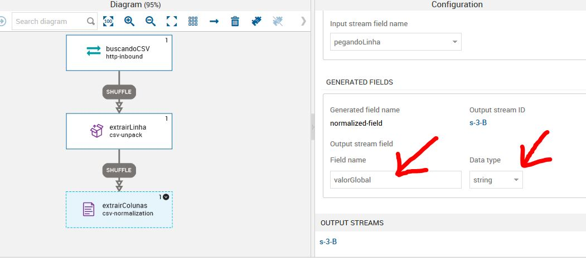

# DMPS - TUTORIAL 01

Elaborado por:
 
Jonathan Cardoso Lopes Domingos
 
02/01/2020

Neste exemplo iremos importar um CSV via http. O csv pertence ao site do <button onclick="window.open('http://dados.turismo.gov.br/');">Ministério do Turismo</button>. Este csv contém entre outras, as informações
sobre ementa parlamentar destinado a alguns municípios brasileiros. 

## Importando CSV via http.

OBS: Para esta série de atividades estarei utilizando o DMPS em uma máquina virtual na AWS.

> Tela inicial do login do DMPS

-------------------------

------------------------

> Plataforma de Trabalho do DMPS

-------------------------

------------------------

> Iniciando um novo Job

-------------------------

------------------------

> Adicionar nome e descrissão

-------------------------

------------------------

> No lado esquerdo temos os Jobs steps, que são estapas do nosso fluxo de decião. 

-------------------------

------------------------

## Job Step: http-inbound

> Para importar um CSV de um link HTTP usaremos o Job step **http-inbound**. Basta segurar e arrastar o job para o centro da mesa de trabalho. 

-------------------------

------------------------

> Dando um duplo clique sobre o job step, voce pode comecar a configura-lo. Siga o passo das imagens abaixo. 

-------------------------

------------------------

OBS: O DMPS obriga você a escolher uma autenticação, mesmo que o link seja livre. 
No nosso caso usaremos um link livre. Logo em Username e Password você poderá colocar qualquer caractere. 
Eu optei por colocar admin no Username e admin no Password. 

link para o arquivo csv:  

> http://dados.turismo.gov.br/images/csv/emendas/2017-emendas.csv

-------------------------

------------------------

-------------------------

------------------------

> Antes de colocar nosso próximo job step, observe o nosso dataset:

-------------------------

------------------------

> Nossa tabela apresenta algumas inconsistencias nos dados que, na medida que avançaremos com
os tutoriais, iremos corrigir. 

## Job Step: csv-unpack

> Este job faz um "reconhecimento" de uma linha do nosso dataset. Assim podermos trabalhar com índices. 

-------------------------

------------------------

-------------------------

------------------------

-------------------------

------------------------

## Job Step: csv-normalization

> Este job "diz" quais coluna(dados) iremos utilizar em nosso fluxo. 

-------------------------

------------------------

OBS: Sempre ver qual é o delimitador do seu CSV.

-------------------------

------------------------

> Pegando os dados da coluna 0 (NºConvênio) do nosso dataset e atribuindo o nome de numeroConvenio.
Neste caso estamos dizendo para o nosso fluxo utilizar a coluna zero do nosso dataset, porém ela recebera, dentro do DMPS, o nome de numeroConvenio.

-------------------------

------------------------

-------------------------

------------------------

> Como vamos trabalhar com mais dados do nosso csv, iremos adicionar quantas iterações necessárias. Cada iteração corresponde a uma coluna que iremos trabalhar. 
Para este Job iremos utilizar as seguintes colunas com os seguintes nomes:

iterations:

- 0 = numeroConvenio
- 1 = modalidade
- 2 = uf 
- 3 = local
- 4 = valorGlobal

-------------------------

------------------------

-------------------------

------------------------

> Lembre-se de salvar seu progresso com frequência:

-------------------------

------------------------

-------------------------

------------------------

-------------------------

------------------------

-------------------------

------------------------

-------------------------

------------------------

> Observe que no exemplo a seguir, o valorGlobal receberá o tipo de string. 
Isso acontece por que a notação da coluna Valor Global está com um ponto 
como separador do número (295.500). Neste caso teremos que tratar este dado (o que faremos mais
a diante) para que ele se torne um número inteiro. 
Se você tentar converter sem tratar o DMPS irá mante-lo como string. Ele não 
irá transformar o arquivo em Float pois tem dados que possuem dois pontos (1.239.346).

-------------------------

------------------------

-------------------------

------------------------

## Job Step: Script 

> Neste job step iremos tratar o problema com os dados valorGlobal. Iremos retirar o ponto e transformar 
o tipo de string para integer. 

-------------------------

------------------------

> Você pode escolher entre Python e JavaScrip, recomendo utilizar o Python, 
reza a lenda que ele é infinitas vezes melhor que JS. 

-------------------------

------------------------

> Selecione a variavel que iremos tratar.

-------------------------

------------------------

> Nomeie uma nova variavel de saída. 
Neste caso, a variável valorGlobal do tipo 
string ira sair como novoValorGlobal do tipo
integer. 

-------------------------

------------------------

> Criando um código python para retirar as inconsistencias dos dados. 

-------------------------

------------------------

> Lembre-se (SALVAR)

-------------------------

------------------------

## Job Step: Visualization-Store

> Agora iremos colocar um job step que permite visualizar os
resultados do nosso processo de stream de dados. 

-------------------------

------------------------

-------------------------

------------------------

## Job Step: Visualization-Store (Erro)

> Iremos adicionar outro visualization-store para as saídas de erros. 
Todo job que possui códigos está sujeito a uma série de erros, logo
a visualization de erro nos permite ter um log de erros. 

-------------------------

------------------------

-------------------------

------------------------

> Antes de testar nosso job, iremos fazer um filtro das variáveis que
queremos que siga o nosso fluxo. 

> Dê um duplo clique no fluxo (SHUFFLE) que está entre tratamentoDados e resultados
e desmarque as seguintes opções.  

-------------------------

------------------------

## Testando o Fluxo:

> Após todo o processo de construção do fluxo iremos testar. 
Clicar em salvar, verificar o código e por fim clicar em enviar. 

-------------------------

------------------------

> Após enviar, você poderá verificar que o seu job estará em situação de 
configurado. Agora bastar rodar o Job e esperar que esteja tudo pronto. 

-------------------------

------------------------

> Algumas informações podem indicar que seu job está funcionando. Observe as imagens a seguir:

-------------------------

------------------------

-------------------------

------------------------

## Visualizando Resultados

> Vá na aba visualization e clique em jobs

-------------------------

------------------------

-------------------------

------------------------

> Selecione o nome do seu Job

-------------------------

------------------------

> Os resultados das suas variáveis irão aparecer.

-------------------------

------------------------

> Podemos observar que o novoValorGlobal foi alterado para inteiro. Podemos observar, também, que um valor não está correto.
A variável local está recebendo o valor da coluna Valor Global do nosso csv. 

-------------------------

------------------------

## Corrigindo o ERRO

> Para corrigir o erro devemos voltar ao job step que pega as colunas do csv. 
Mas para isso devemos parar o nosso job. 

-------------------------

------------------------

> Ir em configure job

-------------------------

------------------------

> Dar um duplo clique no job estrairColunas e procurar a iteration que está com problema. 
Neste caso, a iteration 4. Você deverá mudar o fild position para 3. 

-------------------------

------------------------

-------------------------

------------------------

> Por que isso ocorre?

Observe a imagem a seguir:

-------------------------

------------------------

A nossa iteration 4 é a variavél local e no nosso csv a variável 
local está com 3. Isso ocorre por que no csv a primeira coluna é 
a coluna 0 e as iterações começam do 1. 
Após a alteração devemos salvar. Para que as alterações sejam de 
fato visualizada no nosso visualisation job devemos deletar o cash. 
Ir na aba visualization e clicar em jobs. Ir na opção **stores**

-------------------------

------------------------

> Em stores clique em atualizar, digite o nome do seu job, clique nos três pontinhos e por fim  deletar. 

-------------------------

------------------------

> Após deletar o cash do seu job vá na aba JOBS, clique em All, 
digite o nome do seu job e clique sobre ele. 

-------------------------

------------------------

-------------------------

------------------------

> Agora basta ir em rodar. 

-------------------------

------------------------

> Se tudo deu certo, seu job apresentará os comportamentos normais. 
Como já visualizado anteriormente. 

-------------------------

------------------------

> Agora basta ir em visualization - jobs - Discover e selecionar o seu job.
Podemos observar que a variavel local está corrigida. Agora ela apresenta
o nome do município.  
