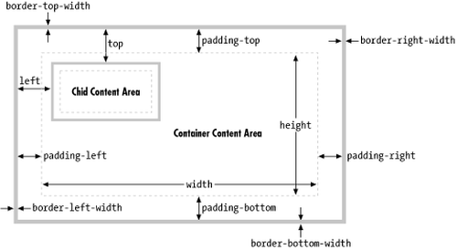

# CSS - Cheat Sheet 

<div class="panel panel-info">
AINDA EM CONSTRUÇÃO
</div>

Esta documentação é apenas um guia rápido de CSS básico que utilizo no dia-a-dia. 

1 - Estrutura de área:




2 - No CSS temos três formas de elaborar uma formatação:

> -------------------- Formatação incorporada:

```html
<head>
    <title> Incorporado </title>
    <style type="text/css"> 
        h1{
            color: rgb(8, 14, 41);
            padding: 10px 20px;
            border-radius: 8px;
            border: 0;
            background: #ddd;
            font-size: 35px;
            font-family: Verdana, Geneva, Tahoma, sans-serif;
        }    
    </style>
</head>

<body>
    <h1> Titulo do Texto</h1>
</body>

```


> ------------------------ Formatação inline:

```html
<head>
    <title> Incorporado </title>
</head>

<body>
    <h1 style="padding: 30px 20px; 
                border-radius: 8px; 
                border: 0; 
                background: #ddd;"> Titulo do Texto</h1>
</body>
```


> ----------------------------- CSS externo:

```html

<head>
    <link rel="stylesheet" href="arquivo.css">
    <title> Moonlight </title>
</head>

<body>

    <h1> Melhores RPGs </h1>

    <p id="Story">
        Vagrant Story é um jogo eletrônico de RPG desenvolvido pela Squaresoft, 
        lançado para o PlayStation em 2000 e relançado 9 anos depois em formato de 
        download na Playstation Network, disponibilizando-o assim para PlayStation 3 
        e PlayStation Portable..
    </p>
    
    <p class="classFormat">
        Final Fantasy é uma franquia multimídia de ficção científica e fantasia 
        criada por Hironobu Sakaguchi e desenvolvida pela Square Enix. A franquia é 
        centrada em uma série de jogos eletrônicos do gênero RPG.
    </p>

</body>
```

> arquivo.css

```css


/* Formatação direto em tag. */
body {
    width: 100%;
    max-width: 580px;
    margin: 0 auto;
    padding: 20px 20px;
}

h1 {
    border-radius: 8px;
    background: #8787af;
    border: 1px solid #303030;
    padding: 10px 10px;
}


/* No caso do id, eu estou atribuindo uma 
formatação ao id criado no html. */
#Story{
    padding: 30px 20px; 
    border-radius: 8px; 
    background: #ddd;
    border: 1px solid #303030;
}


/* No caso da classe, eu crio a classe e 
utilizo sua funcionalidade em quelquer 
lugar do html que eu desejar, basta invocar. */
.classFormat {
    padding: 30px 20px; 
    border-radius: 8px; 
    background: #ddd;
}
```
> Referências:

> https://docstore.mik.ua/orelly/webprog/jscript/ch18_02.htm
> http://ictacademy.com.ng/css-height-width/