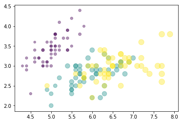

# O que você vai encontrar aqui?

Olá, muito prazer! Me chamo Jonathan. Se você, assim como eu, é apaixonado por dados, está na documentação certa. Esta é a minha documentação de Data-Science. **Enjoy it!**

**Mas afinal, o que você irá encontrar aqui?**

**Dados**
```python
In [1]: iris.head()
Out[8]:	        Sepal.Length	Sepal.Width	    Petal.Length	Petal.Width    	Species	    SpeciesNumber
            1	     5.1	        3.5	            1.4	            0.2	        setosa	        0
            2	     4.9	        3.0	            1.4	            0.2	        setosa	        0
            3	     4.7	        3.2	            1.3	            0.2	        setosa	        0
            4	     4.6	        3.1	            1.5	            0.2	        setosa	        0
            5	     5.0	        3.6	            1.4	            0.2	        setosa	        0
```

**Gráficos**

```python
In [1]: plt.scatter(
        iris['Sepal.Length'], iris['Sepal.Width'], sizes=20 * iris['Petal.Length'],
        c=iris['SpeciesNumber'], cmap='viridis', alpha=0.4
        )
Out[8]: <matplotlib.collections.PathCollection at 0x7f056ae2d3c8>
```



## Python

Como toda boa análise de dados, é necessário uma boa ferramenta de manipulação destes dados. Nesta documentação, para tanto, utilizarei o python e suas distribuições anaconda, ou seja, utilizaremos o Numpy, Pandas, Seaborn, Geopandas, etc. 

 Patra ver mais sobre a distribuição anaconda clique [aqui ](https://www.anaconda.com/distribution/).

## Tutorial

Nesta documantação falaremos o tempo todo em ferramentas de manipulação de dados, logo recomendo, fortemente, que você tenha instalado a distribuição anaconda, pois ela já vem munida da linguagem de programação python e sua principais bibliotecas. Caso contrário poderá instalar o python e as bibliotecas separadamente. 

###[ANACONDA ](https://www.anaconda.com/distribution/)
###[PYTHON ](https://www.python.org/downloads/)

