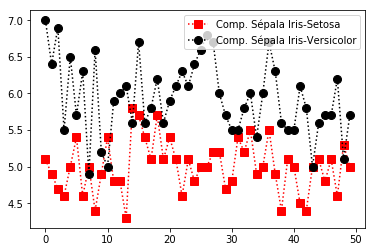

# Matplotlib

Segundo a documentação oficail, o Matplotlib é uma biblioteca de plotagem 2D do Python que produz inúmeros gráficos de qualidade em uma variedade de formatos e ambientes interativos. O Matplotlib pode ser usado em scripts Python, nos shells do Python e do IPython, no notebook Jupyter, nos servidores de aplicativos da web e em kits de ferramentas de interface gráfica do usuário. Para mais informações sobre esta biblioteca, clicar [aqui ](https://matplotlib.org/).

Neste tutorial, o matplotlib será utilizado com o auxíio do numpy e do data-set iris, que pode ser encontrado [aqui ](https://archive.ics.uci.edu/ml/machine-learning-databases/iris/). OBS: cliclar na opção iris.data

**Instalação - Matplotlib**

Essa biblioteca não é nativa do Python, logo você precisará intalar. Se você baixou o pacote Anaconda, como recomenda na página home desta documentação, o matplotlib  já estará incluso, caso contrário, você deverá utilizar a ferramenta pip do seu python. Digite o seguinte comando no seu terminal linux ou prompt  windowns.

```python
pip install matplotlib
```
---
# Tutorial

**Importando as bibliotecas**
Utilizando o editor de sua preferência como o vsCode, atom ou Pycharme, importe as bibliotecas. 

```python
import numpy as np
import matplotlib.pyplot as plt
%matplotlib inline
```

O uso do matplotlib inline é recomendado para que estiver utilizando o jupyter, para que o gráfico seja plotado em sua linha de comando. Quem estiver utilizando o shell, terminal ou ipython, recomenda-se colocar o plt.show() no final de cada chamada de gráfico. 


**Lendo o data set**

Atenção: o caminho ../_DATASET correspondo ao local que esta salvado o meu arquivo irirs.data.


```python
In [1]: data = np.genfromtxt('../_DATASET/iris.data', delimiter=',', usecols=(0,1,2,3))

In [2]: data

Out[2]: array ([[5.1, 3.5, 1.4, 0.2],
                [4.9, 3. , 1.4, 0.2],
                [4.7, 3.2, 1.3, 0.2],
                [4.6, 3.1, 1.5, 0.2],
                [5. , 3.6, 1.4, 0.2],
                [5.4, 3.9, 1.7, 0.4],
                [4.6, 3.4, 1.4, 0.3],
                [5. , 3.4, 1.5, 0.2],
                [4.4, 2.9, 1.4, 0.2],
                [4.9, 3.1, 1.5, 0.1],
                [5.4, 3.7, 1.5, 0.2],
                [4.8, 3.4, 1.6, 0.2],
                [4.8, 3. , 1.4, 0.1],
                [4.3, 3. , 1.1, 0.1],
                [5.8, 4. , 1.2, 0.2],
                [5.7, 4.4, 1.5, 0.4],
                [5.4, 3.9, 1.3, 0.4],
                [5.1, 3.5, 1.4, 0.3],
                [5.7, 3.8, 1.7, 0.3],
                [5.1, 3.8, 1.5, 0.3],
                [5.4, 3.4, 1.7, 0.2],
                [5.1, 3.7, 1.5, 0.4],
                [4.6, 3.6, 1. , 0.2],
                [5.1, 3.3, 1.7, 0.5],
                [4.8, 3.4, 1.9, 0.2],
                [5. , 3. , 1.6, 0.2],
                [5. , 3.4, 1.6, 0.4],
                [5.2, 3.5, 1.5, 0.2],
                [5.2, 3.4, 1.4, 0.2],
                [4.7, 3.2, 1.6, 0.2],
                [4.8, 3.1, 1.6, 0.2],
                [5.4, 3.4, 1.5, 0.4],
                [5.2, 4.1, 1.5, 0.1],
                [5.5, 4.2, 1.4, 0.2],
                [4.9, 3.1, 1.5, 0.1],
                [5. , 3.2, 1.2, 0.2],
                [5.5, 3.5, 1.3, 0.2],
                [4.9, 3.1, 1.5, 0.1],
                [4.4, 3. , 1.3, 0.2],
                [5.1, 3.4, 1.5, 0.2],
                [5. , 3.5, 1.3, 0.3],
                [4.5, 2.3, 1.3, 0.3],
                [4.4, 3.2, 1.3, 0.2],
                [5. , 3.5, 1.6, 0.6],
                [5.1, 3.8, 1.9, 0.4],
                [4.8, 3. , 1.4, 0.3],
                [5.1, 3.8, 1.6, 0.2],
                [4.6, 3.2, 1.4, 0.2],
                [5.3, 3.7, 1.5, 0.2],
                [5. , 3.3, 1.4, 0.2],
                [7. , 3.2, 4.7, 1.4],
                [6.4, 3.2, 4.5, 1.5],
                [6.9, 3.1, 4.9, 1.5],
                [5.5, 2.3, 4. , 1.3],
                [6.5, 2.8, 4.6, 1.5],
                [5.7, 2.8, 4.5, 1.3],
                [6.3, 3.3, 4.7, 1.6],
                [4.9, 2.4, 3.3, 1. ],
                [6.6, 2.9, 4.6, 1.3],
                [5.2, 2.7, 3.9, 1.4],
                [5. , 2. , 3.5, 1. ],
                [5.9, 3. , 4.2, 1.5],
                [6. , 2.2, 4. , 1. ],
                [6.1, 2.9, 4.7, 1.4],
                [5.6, 2.9, 3.6, 1.3],
                [6.7, 3.1, 4.4, 1.4],
                [5.6, 3. , 4.5, 1.5],
                [5.8, 2.7, 4.1, 1. ],
                [6.2, 2.2, 4.5, 1.5],
                [5.6, 2.5, 3.9, 1.1],
                [5.9, 3.2, 4.8, 1.8],
                [6.1, 2.8, 4. , 1.3],
                [6.3, 2.5, 4.9, 1.5],
                [6.1, 2.8, 4.7, 1.2],
                [6.4, 2.9, 4.3, 1.3],
                [6.6, 3. , 4.4, 1.4],
                [6.8, 2.8, 4.8, 1.4],
                [6.7, 3. , 5. , 1.7],
                [6. , 2.9, 4.5, 1.5],
                [5.7, 2.6, 3.5, 1. ],
                [5.5, 2.4, 3.8, 1.1],
                [5.5, 2.4, 3.7, 1. ],
                [5.8, 2.7, 3.9, 1.2],
                [6. , 2.7, 5.1, 1.6],
                [5.4, 3. , 4.5, 1.5],
                [6. , 3.4, 4.5, 1.6],
                [6.7, 3.1, 4.7, 1.5],
                [6.3, 2.3, 4.4, 1.3],
                [5.6, 3. , 4.1, 1.3],
                [5.5, 2.5, 4. , 1.3],
                [5.5, 2.6, 4.4, 1.2],
                [6.1, 3. , 4.6, 1.4],
                [5.8, 2.6, 4. , 1.2],
                [5. , 2.3, 3.3, 1. ],
                [5.6, 2.7, 4.2, 1.3],
                [5.7, 3. , 4.2, 1.2],
                [5.7, 2.9, 4.2, 1.3],
                [6.2, 2.9, 4.3, 1.3],
                [5.1, 2.5, 3. , 1.1],
                [5.7, 2.8, 4.1, 1.3],
                [6.3, 3.3, 6. , 2.5],
                [5.8, 2.7, 5.1, 1.9],
                [7.1, 3. , 5.9, 2.1],
                [6.3, 2.9, 5.6, 1.8],
                [6.5, 3. , 5.8, 2.2],
                [7.6, 3. , 6.6, 2.1],
                [4.9, 2.5, 4.5, 1.7],
                [7.3, 2.9, 6.3, 1.8],
                [6.7, 2.5, 5.8, 1.8],
                [7.2, 3.6, 6.1, 2.5],
                [6.5, 3.2, 5.1, 2. ],
                [6.4, 2.7, 5.3, 1.9],
                [6.8, 3. , 5.5, 2.1],
                [5.7, 2.5, 5. , 2. ],
                [5.8, 2.8, 5.1, 2.4],
                [6.4, 3.2, 5.3, 2.3],
                [6.5, 3. , 5.5, 1.8],
                [7.7, 3.8, 6.7, 2.2],
                [7.7, 2.6, 6.9, 2.3],
                [6. , 2.2, 5. , 1.5],
                [6.9, 3.2, 5.7, 2.3],
                [5.6, 2.8, 4.9, 2. ],
                [7.7, 2.8, 6.7, 2. ],
                [6.3, 2.7, 4.9, 1.8],
                [6.7, 3.3, 5.7, 2.1],
                [7.2, 3.2, 6. , 1.8],
                [6.2, 2.8, 4.8, 1.8],
                [6.1, 3. , 4.9, 1.8],
                [6.4, 2.8, 5.6, 2.1],
                [7.2, 3. , 5.8, 1.6],
                [7.4, 2.8, 6.1, 1.9],
                [7.9, 3.8, 6.4, 2. ],
                [6.4, 2.8, 5.6, 2.2],
                [6.3, 2.8, 5.1, 1.5],
                [6.1, 2.6, 5.6, 1.4],
                [7.7, 3. , 6.1, 2.3],
                [6.3, 3.4, 5.6, 2.4],
                [6.4, 3.1, 5.5, 1.8],
                [6. , 3. , 4.8, 1.8],
                [6.9, 3.1, 5.4, 2.1],
                [6.7, 3.1, 5.6, 2.4],
                [6.9, 3.1, 5.1, 2.3],
                [5.8, 2.7, 5.1, 1.9],
                [6.8, 3.2, 5.9, 2.3],
                [6.7, 3.3, 5.7, 2.5],
                [6.7, 3. , 5.2, 2.3],
                [6.3, 2.5, 5. , 1.9],
                [6.5, 3. , 5.2, 2. ],
                [6.2, 3.4, 5.4, 2.3],
                [5.9, 3. , 5.1, 1.8]])
```
**Selecionar somente a coluna, ou seja, selecionar somente o comprimento das sepolas**

```python
In [3]: data[:,0]

Out[3]: array([5.1, 4.9, 4.7, 4.6, 5. , 5.4, 4.6, 5. , 4.4, 4.9, 5.4, 4.8, 4.8,
       4.3, 5.8, 5.7, 5.4, 5.1, 5.7, 5.1, 5.4, 5.1, 4.6, 5.1, 4.8, 5. ,
       5. , 5.2, 5.2, 4.7, 4.8, 5.4, 5.2, 5.5, 4.9, 5. , 5.5, 4.9, 4.4,
       5.1, 5. , 4.5, 4.4, 5. , 5.1, 4.8, 5.1, 4.6, 5.3, 5. , 7. , 6.4,
       6.9, 5.5, 6.5, 5.7, 6.3, 4.9, 6.6, 5.2, 5. , 5.9, 6. , 6.1, 5.6,
       6.7, 5.6, 5.8, 6.2, 5.6, 5.9, 6.1, 6.3, 6.1, 6.4, 6.6, 6.8, 6.7,
       6. , 5.7, 5.5, 5.5, 5.8, 6. , 5.4, 6. , 6.7, 6.3, 5.6, 5.5, 5.5,
       6.1, 5.8, 5. , 5.6, 5.7, 5.7, 6.2, 5.1, 5.7, 6.3, 5.8, 7.1, 6.3,
       6.5, 7.6, 4.9, 7.3, 6.7, 7.2, 6.5, 6.4, 6.8, 5.7, 5.8, 6.4, 6.5,
       7.7, 7.7, 6. , 6.9, 5.6, 7.7, 6.3, 6.7, 7.2, 6.2, 6.1, 6.4, 7.2,
       7.4, 7.9, 6.4, 6.3, 6.1, 7.7, 6.3, 6.4, 6. , 6.9, 6.7, 6.9, 5.8,
       6.8, 6.7, 6.7, 6.3, 6.5, 6.2, 5.9])
```

**Selecionar a primeira coluna, somente os 50 primeiros dados, ou seja, Iris Setosa**

```python
In [4]: data[:50,0]

Out[4]: array([5.1, 4.9, 4.7, 4.6, 5. , 5.4, 4.6, 5. , 4.4, 4.9, 5.4, 4.8, 4.8,
       4.3, 5.8, 5.7, 5.4, 5.1, 5.7, 5.1, 5.4, 5.1, 4.6, 5.1, 4.8, 5. ,
       5. , 5.2, 5.2, 4.7, 4.8, 5.4, 5.2, 5.5, 4.9, 5. , 5.5, 4.9, 4.4,
       5.1, 5. , 4.5, 4.4, 5. , 5.1, 4.8, 5.1, 4.6, 5.3, 5. ])

```
#Plotando Gráficos

**plotando o gráfico das 50 primeiras iris(iris setosa)(coluna 1)**

```python
In [5]: plt.plot(data[:50,0], c='Red', ls=':', marker='s', ms=8)

Out[5]: [<matplotlib.lines.Line2D at 0x7f2844d13940>]

```
Gráfico plotado.


 OBS: Caso não esteja usando o jupyter, você deverá colocar plt.show(), como no exemplo abaixo:

```python
In [6]: plt.plot(data[:50,0], c='Red', ls=':', marker='s', ms=8)
In [7]: plt.show()
```

**Selecionar a primeira coluna, somente dos 50 a 100, ou seja, Iris Versicolor**

```python
In [8]: data[50:100,0]

Out[8]: array([7. , 6.4, 6.9, 5.5, 6.5, 5.7, 6.3, 4.9, 6.6, 5.2, 5. , 5.9, 6. ,
       6.1, 5.6, 6.7, 5.6, 5.8, 6.2, 5.6, 5.9, 6.1, 6.3, 6.1, 6.4, 6.6,
       6.8, 6.7, 6. , 5.7, 5.5, 5.5, 5.8, 6. , 5.4, 6. , 6.7, 6.3, 5.6,
       5.5, 5.5, 6.1, 5.8, 5. , 5.6, 5.7, 5.7, 6.2, 5.1, 5.7])

```
**Plotando um gráfico comparativos das petolas da: Iris Setosa e Iris Versucolor**

```python
In [8]: plt.plot(data[:50,0], c='Red', ls=':', marker='s', ms=8, label='Comp. Sépala Iris-Setosa')
        plt.plot(data[50:100,0], c='Black', ls=':', marker='o', ms=8, label='Comp. Sépala Iris-Versicolor')
        plt.legend()
        plt.show()
```
Gráfico plotado.




